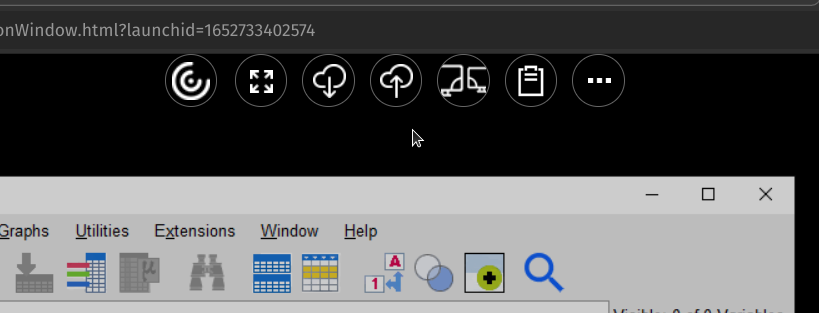
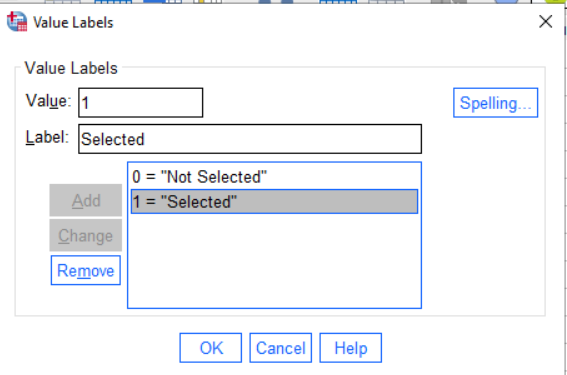
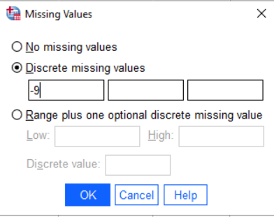
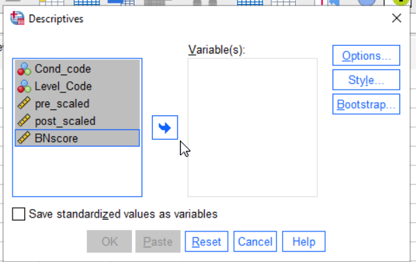
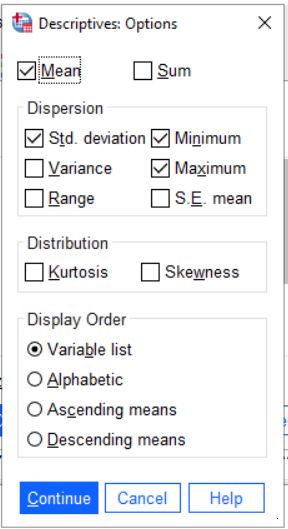
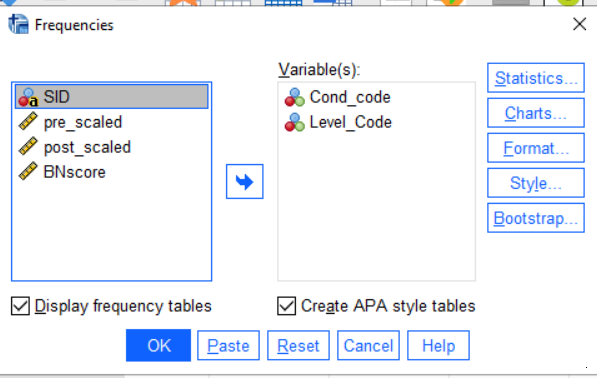
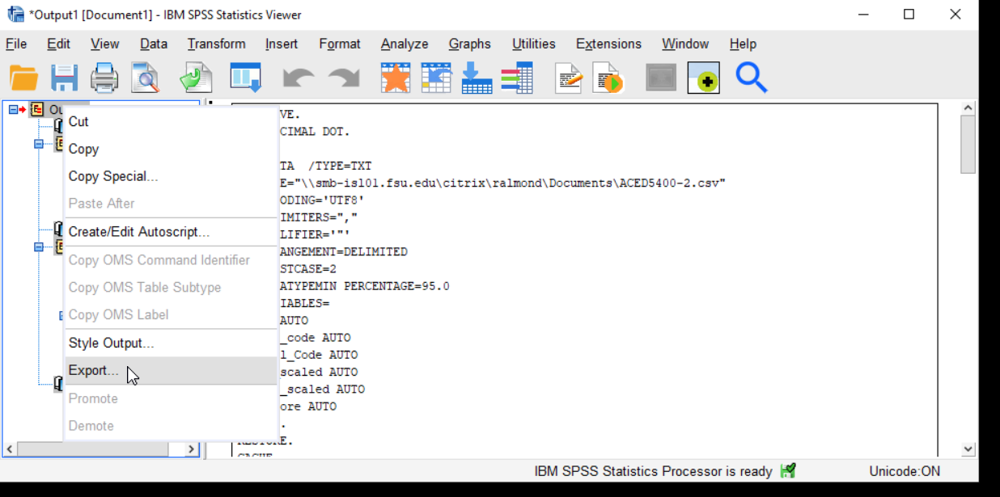

```{r setup, include=FALSE}
knitr::opts_chunk$set(echo = TRUE)
```

# Introduction to the Labs

In the course of four labs, you (working in groups of up to 3 people) are going to write a short paper addressing a question about attention deficit hyperactivity disorder (ADHD) and anxiety. This will use data collected by Prevat, Dehili, Taylor and Marshal (2015) and will replicate some of their results.

To make this task somewhat more manageable, we will split writing the paper into four parts:

1.  Getting the data into SPSS (or R) and writing descriptions of the data and measures.

2.  Doing simple summaries, both numerical and graphical of the data.

3.  Looking at relationship between anxiety and ADHD symptoms using regression.

4.  Looking at the difference between students referred for ADHD and randomly selected students using a $t$-test.

After each part, you will submit a draft paper, on which we will give you feedback. You will earn participation points only for the drafts. At the end of the course, at least one member of your group will submit a final report. This is the part that will be scored. This paper is worth 1/4 of the total grade.

## Grading on Style

There are several important goals in having you write the paper. First, in many of your future careers, you will need to write summaries of research. So we are going to get you used to writing in academic style. Some of the issue here is that there is a need for more precision in academic writing than in casual speach. For example, if I said to you "*Dinotopia* is a book about dinosaurs in the library," I could clue you in with my vocal accents whether it was a book about *dinosaurs in the library* or a *book in the library* about dinosaurs (it could be both, *Dinotopia* does have a scene with dinosaurs in a library).

Some of the rules of academic language are common to general good writing. There should be one paragraph per topic, and each paragraph should have a topic sentence. Others are related to the need for precision; if you write "We fit the model to the data," is it clear which model was fit to which data set? Finally, there are technical terms that need to be used in the correct way. For example, "significance" has a very technical meaning in statistics, so using if for it lay meaning of "large and important" implies thing about the support of the data for the claim which you might not mean.

Writing about data will also help you gain greater depth in your statistical vocabulary. By writing about the data, you learn about what is important to look for when reading other peoples statistics. You will also learn more about how to use the terms. It also helps the teaching staff identify points of confusion you might still have about the some of the statistical terms.

In addition to the rules for text, there are rules for figures (plots) and tables. Each should be given a caption which tells something about it. The rows and columns of the table and the axis of the graph should be human readable names and not the abbreviations often used for variable names in stat packages. You should the right number of significant digits: too many or two few obscures the relationships you are trying to describe.

The grading for the final report will be split with 60% for doing the correct analysis and 40% for having good academic style. I am somewhat flexible here, I don't insist on exact APA style, but it should be close enough (in particular, if your discipline uses a different style, that is fine). But it is important that everything is clear.

## Using SPSS

This version of the lab handout assumes that you are using `SPSS` to do the computing. I don't actually care which statistics package you use. I will try to write alternative instructions for using the free `R` statistics package; however, you already know `Stata` or want to write your own code in `python`, more power to you. I will probably only be able to give you general advice.

SPSS is menu driven, so is somewhat easier to learn than R (which uses command scripts). SPSS is available in 3 ways:

-   The Learning Resource Center (LRC) computer labs in Stone and Tully have a number of computers with SPSS loaded. These can be used unless a class has scheduled the lab. Bring a usb drive to save your files, as these computers are set to erase all of your files when you log out. There is usually somebody at the desk in the LRC who can help with problems logging in and starting SPSS (they may or may not be able to answer SPSS questions).

-   FSU has a virtual computer lab at <https://its.fsu.edu/service-catalog/desktop-and-mobile-computing/its-software/myfsuvlab> . This is supported by the university ITS page. If you are having difficulty getting the virtual lab to run on you computer: (1) try a different browser (e.g., chrome instead of firefox) and (2) contact the ITS help line (information on the page referenced above).

-   You could purchase your own version of SPSS (or you might have access on another machine though your work). Note that SPSS licenses are time limited, so this is a rather expensive option.

In general, doing your computing in person in the LRC will be easier than working remotely through the virtual lab. The latter is sometimes glitchy and performance will depend on how fast your internet connection is. However, I can put up with a fair amount of lag to avoid driving into campus.

# The Data

The data were gathered by Prevat, et al. (2015). The first step should probably be to read that paper. Pay particular attention to (1) who is in the sample, and how the sample was recruited, and (2) what are the measures and how were they collected. These are vitally important questions because they affect the validity of any conclusion and the extent to which the conclusions can be generalized to a different audience. You will need to summarize these parts of the research in your paper, so take careful notes here.

Next, take a look at the data, in the file `Alec-5400Subset.csv`. (You will need to download this from Canvas; put it somewhere where you can easily find it, many web browsers default to your `Downloads` folder.) This is in the common comma separated value (CSV) format. Each line represents a case and the values for the variables are separated by commas. These files usually have a `.csv` extension. (Another common format is tab separated data, which often has a `.dat` or `.txt` extension).

Here are the first few lines of the data:

    group,YEAR,AGE,GENDER,ETHNICITY,SAT,SATVERBAL,SATQUANT,SATWRIT,GADD,PAG,genanxa,paa,inatt,hyper
    2,2,19,2,1,-9,-9,-9,-9,1,0,4,1,-9,-9
    2,2,20,2,2,-9,-9,-9,-9,1,0,0,0,-9,-9
    2,3,22,2,1,-9,-9,-9,-9,0,0,2,1,-9,-9
    2,2,20,1,1,-9,-9,-9,-9,1,0,4,0,-9,-9
    2,3,20,1,1,-9,-9,-9,-9,3,0,3,0,-9,-9

Notice a couple of things. First, the top line is the name of the variables. This is fairly common. Next, there are a large number of `-9` values. These are missing, so we will need to handle them specially when we import the data. Finally note that there are no string (or character) values with embedded spaces or commas. This is important, because sometimes csv files will use single quotes, double quotes or no quotes at all to mark text strings. Sometimes they also use spaces and tabs in addition to commas. These will all be options in the import dialog box.

Take a look at the column marked "gender". We can guess that 1 and 2 represent male and female students, but is 1 male or female? To answer this question we need a *code book*. This can be found in the file `Alec-5400Subset-Codebook.docx` (or `.pdf`) at the same place you found the raw data.

## Inputting the data

The next step is to read the data into SPSS. So go ahead and start SPSS.

There are a couple of things you might need to do first.

-   *Windows Only*. If you double clicked on the `Alec-5400Subset.csv` file, Windows probably opened the file in Excel. Windows will not let you open the file with another program (e.g., SPSS) while it is open in Excel. So close it in Excel before loading it into SPSS.

-   *Virtual Lab Only*. You will need to upload the `Alec-5400Subet.csv` to the virtual computer. With the virtual computer open, hover the mouse of the hamburger icon in the center top of the virtual lab screen (just above the pointer in the picture).


The upload icon should appear. 



You will then get two file chooser dialogs, the first will let you pick the local file on your computer (`Alec-5400Subset.csv`), the second will ask you where to put it on the remote computer (I would suggest the `Documents` folder). Remember, when working on the remote machine, the SPSS file dialogs refer to files on the remote machine, not the local one.

To read a CSV file, into SPSS version 27 or 28, select `File > Import Data > CSV...` from the menus. (In the documentation for the beta release, IBM gives `File > Import ...`, so they might move this in future versions). This will first open a file picker to let you pick your `.csv` file and then a dialog with a number of options. Check them over to see if you need to change anything, you probably won't. Select `OK` and SPSS will try to read the data file. It will put the results in the spreadsheet like variables view which should now open.

Note that the CSV format is not a standard. Sometimes there are variable names in first line, sometimes not. Sometimes commas, semicolons or tabs are used to delimit values. Sometimes strings are put in single quotes, double quotes or no quotes at all. In Europe, they sometimes use a comma instead of a period for a decimal point. If the data doesn't look right (in particular, if you have extra columns, or values that just look funky), you probably selected the wrong values. Try the import again until you get it right.

## Adding comments to your SPSS transcript

You will notice that in SPSS there are two windows you are using. One has your data, and the other has the output. SPSS will generate the output window as needed. Right now, the contents is not very interesting: it is just a record of how you imported the data. Later the plots and tables generated in response to your commands will appear here. You will be able to save this as a PDF file or Word doc, so that you can copy and paste from it into your report.

You can also add comments to the SPSS output file. This is useful for remember what you were doing when you pick the file up again after being away from the project for a while. The `Insert` menu gives you a number of ways to add comments into the output.

To practice, select `Insert > New Text`, and copy and paste the Prevatt et al. (2015) reference. That way, if you ever pick up the output again, you will remember what data are analyzed in theis file.

## Adding Metadata

Go back to the data editor window. Notice on the bottom there are two tabs marked `Data` and `Variables`. The *data* view is the typical spreadsheet view of the data: columns are variables and rows are cases. The *variables* view gives you the meta-data: the data about the data. You can use the tabs on the bottom or the shortcut `Ctrl+T` (`Cmd+T` on Mac OS) to switch between the two views.


The first column gives the `Name` of the variable. By convention, names need to follow certain conventions (which come from programming languages). They need to start with a letter, they can only contain letters, numbers and a limited number of puctuation marks, they can't contian embedded spaces, and they can only be so long.

For that reason, SPSS also gives a `Label` to each variable. This should be a human readable label; you could also add important information (for example, insted of "AGE" you can have "Age (in years)". Entering labels is good documentation practice. It has an added bonus, when making graphs and tables, SPSS uses the labels instead of the cryptic abbreviated names if they are available. This means your graphs and tables are easier to read (*Style points!*).

The `Type` column tells whether the data are stored as strings or numbers. You usually don't need to set this. If you have data of type string when you were expecting number, that is usually a sign that something went wrong when the file was read in.

The columns width, decimal, columns and align control the appearance of the data in the data view.

## Setting Value Labels

The scale column tells SPSS whether a variable is Nominal, Ordinal or Interval/Ratio Scale (SPSS does not distinguish between Interval and Ratio scales). SPSS will guess that numeric values are Scale and string variables are nominal. Sometimes you need to fix this.

The nominal and ordinal variables in this data set are all integer coded. That means that each number can be mapped onto a longer name. For example, in the `Years` column, `1="Freshman"`, `2="Sophmore"`, and so on. To indicate to SPSS what the value labels are, click in the box in the `Values` column in the row for the variable we want to enter. You will then see `...` (which is code for click on me, I open another dialog). So click on that, and you will see something like this:



To add values, type the number in the box marked "Value", the label in the box marked "Label" and then hit add. You can use this to add the values one by one. If you make a mistake, select the value/label pair from the list, correct the mistake and press "Change." When you are done, press "OK".

Where do the labels come from? The code book. Look up the variable in the code book, and that will give you the values.

Next switch back to the data view. You probably will see the numbers, and not the values. Select the item `View > Value Labels` (there is a little check box beside it to show if it is selected), the labels will now show in the data editor instead of the integer values. Selecting this again will switch them back. You can work in either view (I prefer to see the labels).

## Coding Missing Values

The data in this sample were gathered over many years. During that time, the protocols used in the clinic changed. In other cases, the measure might just be optional: some students take the SAT, some the ACT, and some neither test (particularly grad students who may have done their undergrad work in another country). In those cases, we need to mark those data points as *missing* or `NA` (not aplicable).

Looking at the code book, the value `-9` is used for `NA`. To tell SPSS how missing values are coded, go to the variable view, and click in the column marked `Missing`. Click the button marked `...` and a dialog like the one below should pop up.

 Select the discrete missing value and enter -9. Hit `OK` to save. Do this for all of the variables (as they all might have missing values).

Why are there multiple possible values? Because there may be more than one kind of missingness. The National Assessment of Educational Progress (NAEP) has three different missing codes:

7.  Question was skipped
8.  Question was not reached
9.  Multiple marks or other scanner error.

Depending on the analysis, you may want to treat those differently (although at a first pass they are all missing).

## Data Cleaning

To check that we have properly accounted for the missing values, calculate some summeries of the data.

To do this, select `Analyze > Descriptive Statistics > Descriptive...` [Note that the underlined letters are keyboard shortcuts, so you can also type `Alt+A E D`, holding the alt key down to select the A, and then the other letters].

The descriptivesdialog asks which variables you want to describe. Select them all and then press the arrow key to move them into the "Variable(s)" column.



Next, press the button marked `Options...`. This is where you get to select which statistics you want to look at. Select `Minimum`, `Maximum`, `Mean` and `Standard Deivation`. The options dialog should then look like this:



Press `Continue` and then `OK`. A table of descriptive statistics should then appear in the results area.

Look at the minimums and maximums. Are there any negative numbers? If so, then you have failed to code the missing values for some variables. Go back, fix that and run it again.

Now check the minimum and maximums against the descriptions of the data in the code book.  You will notice that there are some values that are implausibly large or small.  What could have gone wrong:

* Somebody made a typo when entering data.
* Somebody made a registration error when entering data (this is like a type, but it is when you accidentally skip or dublicate a value, so everything is shifted over by one or more columns).
* Somebody was unclear on how to enter the data
* The value is unusual but correct (maybe there is a person who is 230 cm tall in the sample).

In the first three cases, you will want to go back to the original data if you can and fix the error.  In this case, we don't have that luxury, so we just need to mark out of bounds values as missing.

Consider the SAT data.  A number of people have an SAT of 0, which is not a score the the College Board ever gives out.  So, we can restict the value for the SAT scores to 200 to 800, which is the legal range.  Go back to the missing dialog and using the missing range feature.  This should look like this:


Note we can still mark `-9` as missing.

Now check the other variables carefully against the codebook.  There are a couple of other data entry problems in these data.  Make sure you clean them up before you go on.

For the nominal and ordinal values, you will want to use a slightly different command.  Use `Analyze > Descriptive Statistics > Frequencies...`.  This time, select only the nominal and ordinal variables (these will have the three circles or three bars icons).
You also want APA style tables.  The dialog should look like this:




When you are finished cleaning the data, save it as an `.sav` file.  (If you are on the virtual machine, you will want to copy this down to your local computer).  Make sure you stash a copy someplace safe as you will want to get back to them again.

Congratulations!  You have finished the hardest part of the lab!  I'm not kidding.  Data entry, data cleaning and data management are the hardest parts of data analysis, and certainly the parts that take up most of the time (it gets even harder if you need to merge data from two different sources; many more ways that the process can go wrong).  

## Exporting Figures and Tables

After you save the data set, you want to save the contents of the Statistics Viewer as well.  If you simply hit `Save` in the Statistics Viewer window, SPSS will save the output as a `.spv` file.  This can be read by SPSS, but not other programs.

So what you want to do is export the statistics viewer content in another format (probably a Microsoft Word doc is the easiest one to deal with, but you can also choose PDF or separate PNG or JPG files for each image).  In the Statistics Viewer, right click on `Output` and then select `Export...`.


You could also open a word document and copy and past the figures and tables you want to keep into that.

*Virtual Lab Users Only*  Don't forget that you need to download the file to your local computer.  The download button is next to the upload button.

*If you are working in the LRC (Stone or Tully)* The LRC computers are set to delete all files when you log out.  Make sure you have copied you work to a flash drive, or a share drive, or just email yourself a copy.


# Part 1 of the paper

You will write the final paper in four parts. For this first part, you will concentrate on the introduction. You will also do a just a little bit of analysis to check that you were able to import the data into your chosen stat package.

## Write the Paper

Begin writing the paper. Write it as if you were going to submit it to a journal or conference (not as a class assignment). Your draft should have the following sections:

-   *Introduction* (you can drop the header). Give some background and motivation for the exercise.

-   *Background* (Optional). If you are not in the school psychology program, you can just put one paragraph of background (summarizing Prevat, et al. 2015) in the introduction. If you are in the school psych program, expand the background on ADHD a bit (you should be familiar with the readigs).

-   *Research Question*. We will focus on two research questions: (1) exploring the relationship between ADHD symptoms and anxiety and (2) exploring the difference in anxiety levels between students with and without ADHD. Write these out in your own words. (Note, these should be scientific hypotheses, not the statistical *null hypothesis*; don't worry about this if you haven't learned what a null hypothesis is yet).

-   *Methods: Data Description*. This is not your own data collection, but you do need to summarize how Prevatt, et al. (2015) gathered the data. From where did they come? What are the inclusion and exclusion criteria? How big is the sample: how many ADHD and control students are there.

-   *Methods: Measures*. For each of the measures in the data dictionary, give a brief description. In particular, if this based on a questionnaire, how many questions are there and how are they scored (yes-no? 4-point scale?)

-   Results: Data Description\_. Give some basic descriptive statistics for each variable.

    -   For nominal and ordinal variables, give the number of students in each category, as well as the number of missing values.  Use the `Analyze > Descriptive Statistics > Frequencies ...` command for this.
    -   For scale variables, provide the minimum, maximum, median, mean and standard deivation. Also, note how many missing values there are.  Use the `Analyze > Descriptive Statistics > Descriptives ...` command for this.
    -   You might want to put together a table for the scale variables (this is likely harder to do for the nominal and ordinal variables as they have different numbers of categories).
    -   You don't need to mention whether each variable is ordinal, interval or scale, but obviously, you need to know so you can treat it in the right way.

## Rubric

Note, the points in the rubric refer to the final paper and not the draft, which will be scored 0 (not submitted) or 1 (submitted).  However, this section of the lab will be worth 100 points.

-   Introduction (10 pts)
-   Research Question (10 pts)
-   Data Description (10 pts)
-   Measures Section (10 pts)
-   Data Description Nominal/Ordinal (10 pts)
-   Data Description Scale (10 pts)
-   Text Style (20 pts)
-   Figure/Table Style (20 pts)

## References

Prevatt, F., Dehili, V., Taylor, N. & Marshall, D. (2015). Anxiety in College Students with ADHD: Relationship to Cognitive Functioning. *Journal of Attention Disorders*, *19*, 222-230. <doi:10.1177/1087054712457037>
