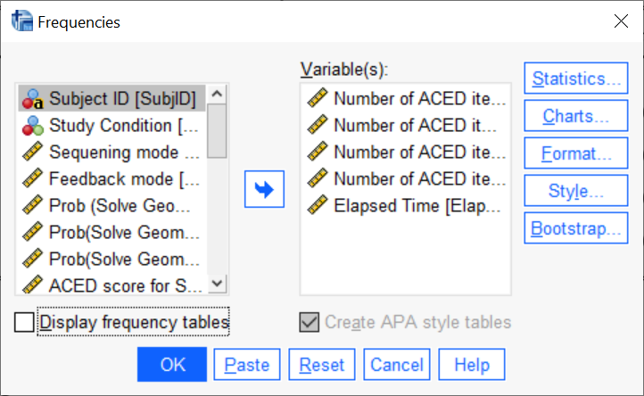
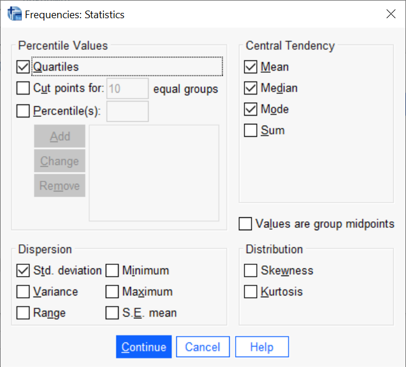
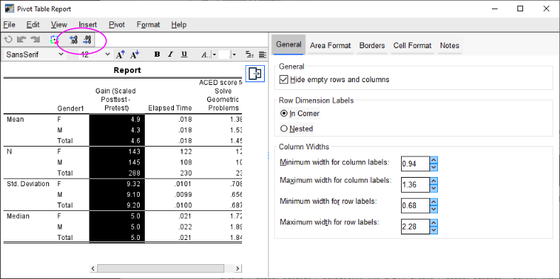
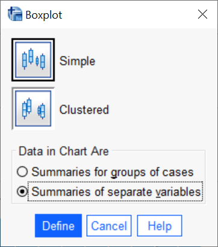
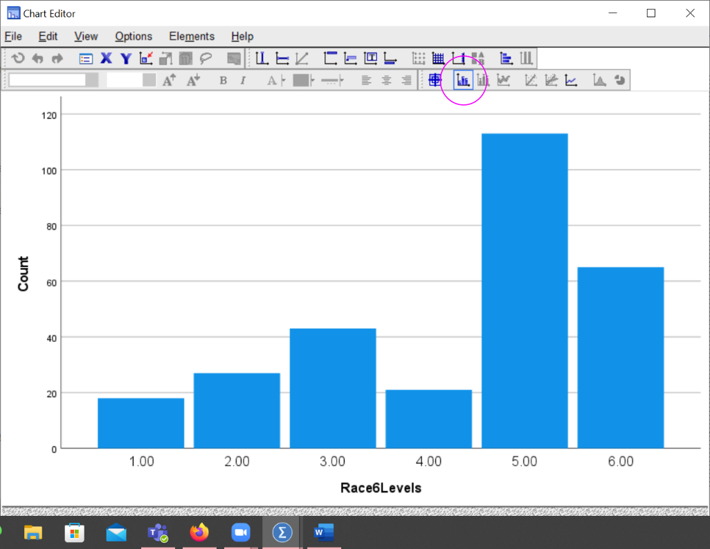
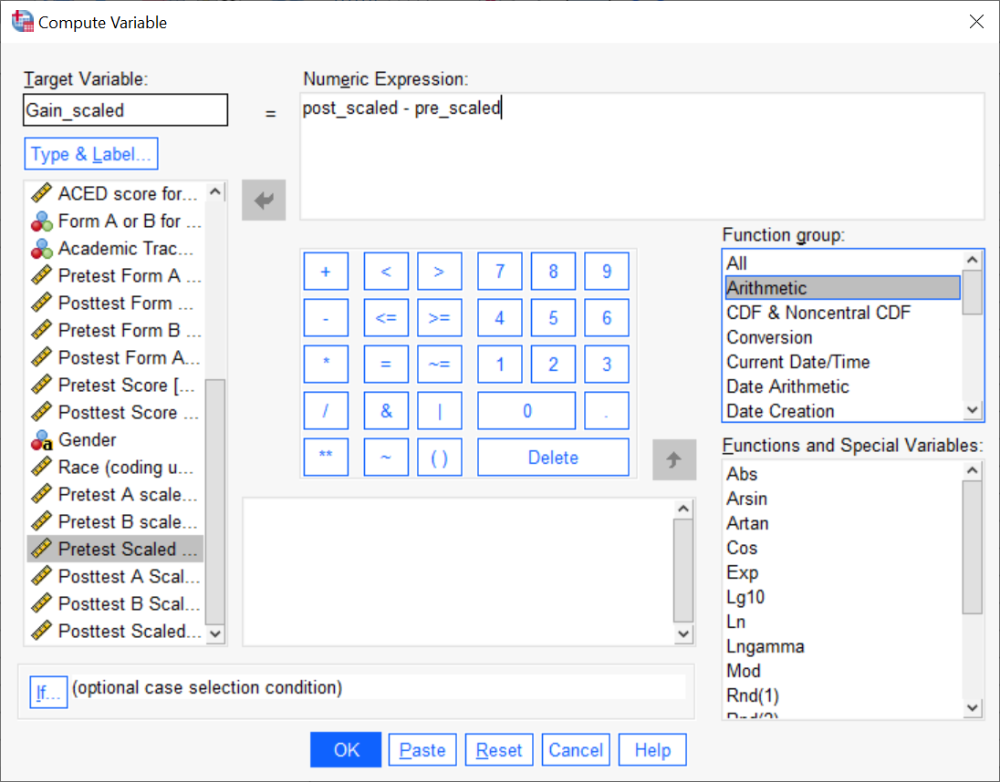
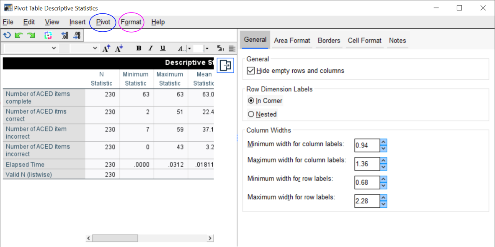
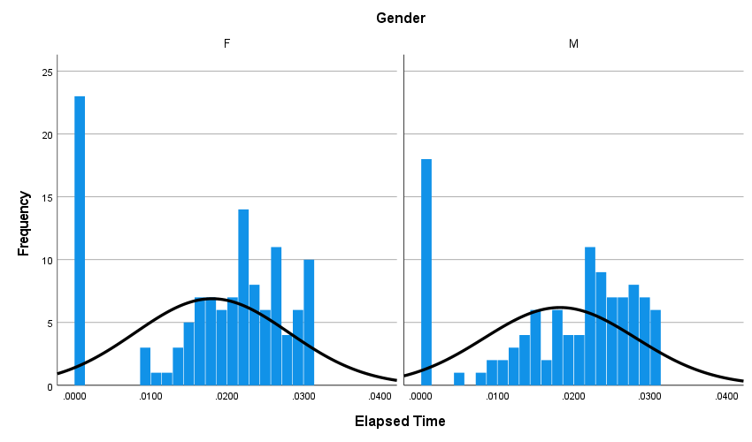
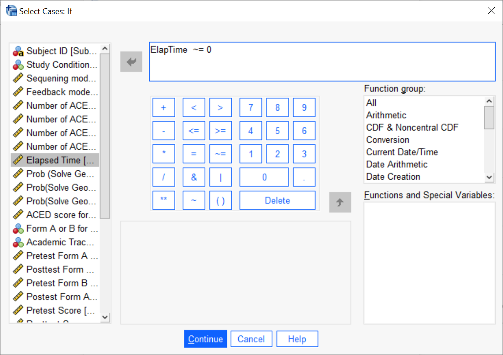

```{r setup, include=FALSE}
knitr::opts_chunk$set(echo = TRUE)
```

# A Recap of Part 1

Part 1 talked about how to load the data into SPSS and clean it.  

I have a slightly larger version of the ACED data set already loaded and cleaned here:
[ACED-Subset-New.sav](https://pluto.coe.fsu.edu/svn/common/rgroup-shiny/ADHDLab/ACED-Subset-New.sav)


# Exploratory Data Analysis

The goal of exploratory data analysis is to get a feeling for the data.  This helps the analyst (1) check that the data was properly entered and cleaned, (2) understand what to expect from the data, and (3) look at potential problems and solutions.

Although the goal is to work model free, a big question at this stage is "Are the data close enough to normal to used statistics based on the normal distribution?"  To do that the analyst want to look at the skewness and kurtosis.  In particular, either strong positive or negative skewness or high kurtosis mean the analyst should consider either transformations of the variables, or robust alternatives to the standard normal theory tests.  Usually graphical displays, particularly, histograms and boxplots, are best for judging skewness and kurtosis.

The other thing we want to mention here is the center and spread. This means either the mean and standard deviation or one of the robust alternatives.  

It is also important to look at the number of valid (non-missing) observations.  If this is subantially different from the total sample size, it can tell the analyst that only a subset of the subjects were measured on some particular variable.  In particular, it can add a selection bias to the statistic, making the results harder to generalize.

## Measures of Center

The two most used measures of center are the `mean` and the `median`.

| Efficient (Normal) | Robust | Poor   |
| ------------------ | ------ | ---------------------- |
| mean               | median | minimum, maximum, mode |

The `mean` is the efficient choice, that means that if the data are approximately normal, the mean will have the lowest standard error for the given sample size.  However, the mean is sensitive to outliers, which are commonly found in distributions with high kurtosis, or strong positive or negative skewness.

The `median` is more robust to departures from normality resistant to outliers, but if the data are approximately normally distributed, the standard error of the median is generally bigger than the standard error of the mean.

The `minimum` and `maximum`, although very useful for data cleaning, are not really useful for describing the location of the data.  If there is one or more outliers, chances are it will be the minimum, the maximum or both.

The `mode` is also not a particularly good measure of center.  Technically, if all of the values are unique, then they are all modes, so we haven't reduced the data at all.  If theree are multiple modes, SPSS just reports the lowest (with a footnote), so real analysts seldom bother with it.

## Measures of Scale

The spread is related to how closely the data points are grouped around the center.  The _standard deviation_ (`SD`) is the usual choice, and the _interquartile range_ (`IQR`) offers a robust alternative.

| Efficient (Normal) | Robust | Poor   |
| ------------------ | ------ | --------|
| sd                 | IQR    | range  |
|                    | mad    |    |
                  
The formal statistical definition of the range is `max - min`.  It is fairly common to think of the pair `(min, max)` as the range, but that is not what SPSS (or R) computes.  While the actual min and max have some value in checking that the data are properly cleaned, the range itself is neither robust nor efficient.

The _median abosulte deviation_ (`mad`) is another robust measure of spread.  Unfortunately, SPSS does not allow us to select it when making tables of summary statistics.

## Skewness and Kurtosis

Usually, the best way to judge skewness or kurtosis is graphically (using a histogram or a boxplot).  However, SPSS offers a skeweness and kurtosis statistic as well.

A symmetric distribution (like the normal distribution) has a skewness of zero; negative values of the skewness statistic indicate negative skewness; postive values, positive skewness.   In practice, a given set of data is  rarely perfectly symmetric; a sample from a symmetric distribution will have a non-zero skewness statistic.  This is not an issue, unless the skewness is very strong (positive or negative).  

How strong is a cause for concern?  The heuristic I use is to divide the skewness statistic by its standard error (also calculated by SPSS).  If the result is bigger than 2 (or less than -2), then I think that skewness may be an issue.  Otherwise, I go ahead using normal-theory methods.  (By the central limit theorem, if the data are only slightly non-normal, the distribution of the mean will be pretty close to normal.)

I use a similar heuristic for the kurtosis.  The kurtosis statistic is scaled so that the normal distribution has a kurtosis of zero.  Only if the kurtosis statistic is bigger than two standard errors do I start to worry.  Here, I only worry about high kurtosis (heavy tails) as that means lots of outliers.  (High kurtosis slows down the central limit theorem, but low kurtosis is not a problem.)

# Describing Data

This section will look at generating tables of statistics.

## Describe

`Analyze > Descriptive Statistics > Descriptive...` [Alt+A E D], 


## Frequencies

`Analyze > Descriptive Statistics > Frequencies... [Alt+A E F]`






## Table Styles

1. Double click on the table to open it for editing.
2. Look at the menu marked "Format > Style..."
3. "Academic" style is more or less APA style.


Be careful because SPSS tables often contain variables you don't need, or way too many digits.  Generally Speaking, the units for numbers should make the number of digits in the raw data.  For questionnaires that are mostly counts, this means no decimals.  For money, are you rounding to the nearest cent? dollar?  hundred dollars?  

- Means and medians can take one more digit (so if the raw data is an integer, round means to the nearest tenth).
- SDs can take two additional digits (so to the nearest hundredth).



In the table editor (double click on the table to edit), select the cells you want to edit, and press the add or remove digits button to get a reasonable number of digits.


Tables are generally numbered `Table`\ _n_, where the numbers are in order of appearance.  (Books use numbers of the form _chapter_`.`_table_; but papers just use sequential numbers.)  The space between `Table` and the number should be a non-breaking space.  Give the caption a human readable description of what is in the table.  The caption for a table goes above the table.

Caption the table in Word (or whatever word processor you are using) not SPSS, as you may need to renumber it later.  Also, make sure that the table doesn't split across page boundaries, or get separated from hits caption.  (There are check boxes for these things in Word).

# One-dimensional Graphical Summaires


## Histograms

`Graphs > Legacy Dialogs > Histogram...` [Alt+G L I]    


In the graph editor you can edit X and Y axis labels and play with the appearance of the graph.

* The button with a grid of dots is used to open a dialog which can be used to adjust the number of bins in the histogram.

* The button with the normal curve can be used to add a normal or other distributional curve.


## Boxplots

`Graphs > Legacy Dialogs > Boxplot...` [Alt+G L X]

There are two modes in which you can draw boxplots:  Each boxplot is a different variable, or each boxplot is a different group of cases.  For a whole variable summary, pick variables.




Select the variables you want.  The "Case Labels" is optional, it gives you strings for identifying outliers instead of numbers.

Becareful that all of the variables need to be on compatable scales.  In this cases, the "Correct" and "Incorrect" scores were out of 63 items, but the ACED score is on a different scale (-1 to 1); so it just doesn't look good.


## Barcharts

`Graphs > Legacy Dialogs > Bar...` [Alt+G L B]

There are a number of ways of doing bar charts.  You can select them through the "mode" function.  (These mostly matter when you are looking at the relationship between two discrete variables.)




The icon with the numbers above the bars adds counts to the bars.  (It works with pie charts, too).

## Pie Charts

`Graphs > Legacy Dialogs > Pie...` [Alt+G L E]

* Angles are harder to judge than lengths, so pie charts are harder to read than bar charts.
  - 3D pie charts add a visual rotation to the angle judgement, makeing them even worse than 2d pie charts.

* Pie charts give a better sense of part-of-whole than do bar charts.

# Creating New Variables

SPSS allows you to perform mathematical operations on scale variables (and some logical operations on nominal and ordianl ones) to create new variables.

SPSS allows you to recode nominal and ordinal variables in several ways.

## Compute Variables

Select `Transform > Compute Variable ...` [Alt+T C]




## Recoding Variables

The `Automatic Recode` command will work for simple transformations of nominal variables, particularly translating strings to numbers.

The `Recode into Different Categories...` works for more complex cases, including dropping categories and adding missing values.

### String to Numeric

There are some SPSS commands which prefer numeric values for nominal or ordinal values.  Automatic Recode can be used to map strings to numbers.

`Transform > Automatic Recode ...` [Alt+T A]

.

Note that SPSS assigns the numeric labels alphabetically.  This is fine when the values are "Male" and "Female" as which one gets 1 and which 2 (in this case Female=1 and Male=2) is arbitrary.  This can cause a problem when the natural order is not alphabetical (High=1, Medium=3, Low =2).  


### Collapsing Categories

`Transform > Recode into Different Categories...` [Alt+T R]

This function allows the analyst to collapse different categories.  In the example below, categories 1, 4 and 5 are combined into a single new category 1, and 6, 7 and 8 are renumbered to close the gap.


# Breakdown by Category


## Cross-tabs

`Analyze > Compare Means > Means…` [Alt+A M M]
or  `Analyze > Descriptive Statistics > Crosstabs...` [Alt+A E C]

The former is good for breaking a scale variable down by a nominal or ordinal one.  The latter for breaking down a nominal or ordinal variable by the another nominal or ordinal variable.


For the crosstabs, try both rows and columns, which one tells the story better.  Also, don't select more than one of "Row percentages", "Column percentages", or "Total percentages", the table just gets too confusing.


## Pivoting Tables

By default, SPSS does not lay out the compare Means table well.  The analyst eye needs to jump over several rows in the table to compare the mean for Group 1 on Variable 1, to the mean for Group 2 on the same variable.



Pivoting the table can fix this.  (This can be done in SPSS, or in a spreadsheet package like Excel.)  Open the table editor, and select the "Pivot" icon.  You can then drag the dimension labels to swap the rows and columns and which dimension is nested within which other dimension.


## Boxplots and Barplots

`Graphs > Legacy Dialogs > Boxplot...` [Alt+G L X]

Now select the other mode in the boxplot:


There is a new field "Category Axis" in the dialog, this is where the grouping variable goes.


`Graphs > Legacy Dialogs > Bar...` [Alt+G L B]

Bar charts are similar.  When you have two categorical variables, sometimes swapping which one is the main variable and which defines the clusters will make a better plot.  Try it both ways to see.


## Paneling by Rows and Columns

`Graphs > Legacy Dialogs > Histogram...`[Alt+G L I], 

Adding a grouping variable to the "Panel by Rows" field in the histogram dialog will produce multiple histograms that share an axis:


For histograms paneling by rows in much better than paneling by columns because it lines up the X-axis (it doesn't matter as much with other graph types).  The graph by race is paneled by rows.  Note how this makes it easy to judge the difference in center or spread.


The histogram by columns is harder to read, even though there are fewer groups.




# Looking at Subsets of Data

* (Temporarily) Remove outliers
* Temporarily Remove Group

_Sensitivity Analysis_:  Remove potentially influential observations and see how much statistics change.

`Data > Select Cases ...` [Alt+D S]



The rows will then disappear from the Variables view.

Looking at the count in the descriptions of a key variable can help check that it worked right:


**Don't forget to reselect all cases when you are done!**


# Chosing Graphics

## Make them part of the story

## Graphs at end, versus graphs in text

## Figures and Captions

## Meaningful Labels

## Digits and Unnecessary Statistics

# Your Mission

The variables in the lab can be grouped into several categories:

* _Study Condition_:  Group

* _Background Variables_: Gender, Year, Age, Ethnicity

* _SAT_:  SAT, SATVERBAL, SATQUANT, SATWRIT
  - Also, create SATTOTAL by adding Verbal and Quant
  
* _Anxiety Measures_: GADD, genaxa

* _Panic Measures_:  PAG, paa

* _ADHD Measures_: inatt, hyper
  - The complete ADHD measure is the sum of inatt and hyper.
  - Note carefully that the sample size for the ADHD measure is much smaller than for the background variables.  Why this discrepancy and who is missing?
  
1) Describe how the sample is broken down by "Year".  Also, look at the relationship between "Year" and "group".  You will want to use a graph or table to support your results.

2) Describe the distribution of Age in the sample.  You should include measures of center and scale and a description of skewness and kurtosis.  Include a figure which shows the distribution.

3) Describe the distribution of the SATTOTAL (note, you will need to compute this variable, it is not in the original data set).  Again, include center, scale, skewness, kurtosis and a figure to support the latter.

4) Describe the distribution of the anxiety and panic measures.  Again, include center, scale, skewness, kurtosis and a figure to support the latter.
  
5) Describe the distribution of the inatt, hyper, and total ADHD symptoms measures (you will need to compute this).  Again, include center, scale, skewness, kurtosis and a figure to support the latter.

6) Pick on of the anxiety or panic measures and describe how it differs across years.

You can append this information to the Part 1 draft:  this is the first subsection in the "Results" section.


# Rubric for the Lab

Here are the score points for the technical steps in Part 2:

* Create Combined variables (SATTOTAL and ADHDSymptoms) [10 pts]

* Histograms, boxplots, or barplots for all varaibles. [10 points]

* Text summaries which includes information about center, scale and pointers to the figure.  [10 pts]

* Anxiety (or Panic) by Year Comparision (text) [10 pts]

* Anxiety (or Panic) by Year Comparison (graphs and tables) [10 pts]

* Year by Group description. [10 pt]

Style accounts for the remaining 40 points.

* Text style [20 pts]  
  - Pay close attention to sequencing the analyses in a way that makes them easy for the reader to follow.  
  - Make sure that figures and tables have numbers & captions, are referenced in the text and don't split across pages or get separated from their captions.

* Graph and Table Style [20 pts]
  - Labels should be human readable, not SPSS variable names.
  - Reasonable number of digits.
  - Don't include unnecessary statistics.
  - Make sure that the figure or table is part of the story of your paper.
  