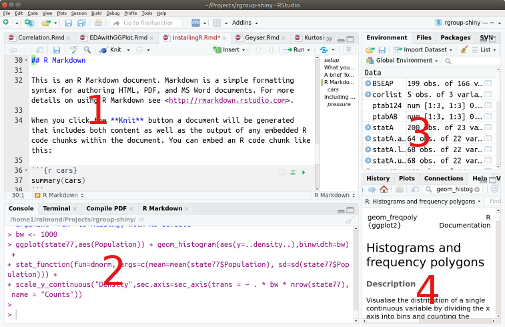
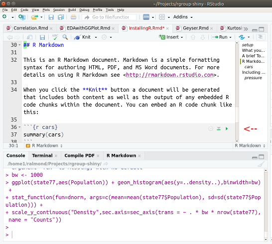
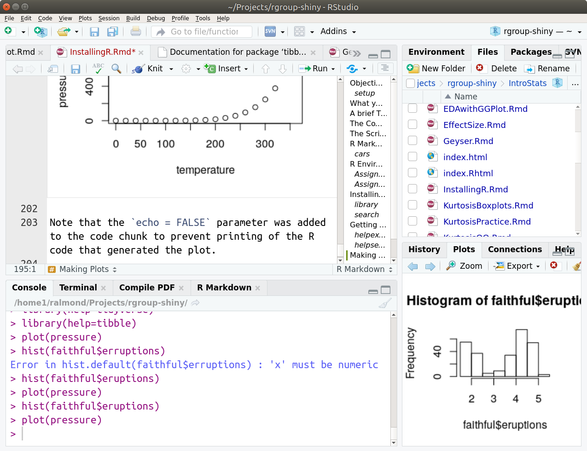

## Objectives

When you finish this lesson, you will be able to 
1) Start and Stop R and R Studio
2) Download, install and run the `tidyverse` package.
3) Get help on R functions.

```{r setup, include=FALSE}
knitr::opts_chunk$set(echo = TRUE)
```

## What you need to Download

R is a programming language for statistics.  Generally, the way that you will work with R code is you will write scripts---small programs---that do the analysis you want to do.  You will also need a development environment which will allow you to edit and run the scripts.  I recommend RStudio, which is pretty easy to learn.  


In general, you will need three things for an analysis job:

* R itself.  R can be downloaded from https://cloud.r-project.org. 

If you use a package manager on your computer, R is likely available there.  The most common package managers are `homebrew` on Mac OS, `apt-get` on Debian Linux, `yum` on Red hat Linux, or `chocolatey` on Windows.  You may need to search for 'cran' to find the name of the right package.  For Debian Linux, it is called `r-base`.

* R Studio development environment.  R Studio  https://rstudio.com/products/rstudio/download/.  The free version is fine for what we are doing.  
 There are other choices for development environments. I use Emacs and ESS, Emacs Speaks Statistics, but that is mostly because I've been using Emacs for 20 years.

* A number of R packages for specific analyses.  These can be downloaded from the Comprehensive R Archive Network, or CRAN.  Go to https://cloud.r-project.org and click on the 'Packages' tab.  We will cover package installation later.

You may want to bookmark the R-project.org web site, as it has lots of useful information, including links to documentation and of course the CRAN library of packages.

Go ahead and download and install R and R Studio using the instructions on those pages.  

## A brief Tour of R Studio



When you open R Studio, the screen is split into four regions.  (You can adjust the size of these regions if you like.)

* Region 1 in the script editor.  This is where you will do the bulk of your work.
* Region 2 is the R command line.  This is where R Studio communicates with the underlying R program.
* Region 3 has a number of different purposes.  Probably the most useful one early on is the "Environment" tab which has all of the R objects you have created.
* Region 4 again as a number of the tabs.  The most useful early on will be "Help" and "Plots".

## The Command Line

Although Region 1 is where we will do most of our work, I'm going to start with Region 2.  This the R console.  R is an interactive programming language.  It prompts you that it is waiting for a command with a `>`.  You can type a command at that prompt and hit return.  R will then print the result of the expression. You can try this.  Try typing `2+2` and then hit `return`.  R should respond `[1] 4`.

  Why the `[1]`.  This is because R always works with vectors.  This indicates that the answer is a vector and the first element is 4.  

 R is a separate program from R Studio.  The console window communicates between the two programs.  In fact, if you open a terminal window (or command window on Windows) in your operating system, and type R, you will get a similar command prompt and can interact directly with R without R Studio.


## The Script Editor

Region 1 contains an editor for R scripts.  When I'm doing data analysis, I want to keep a record of all of the steps I took in doing the analysis.  That is the script.  An R script file is just a series of R commands, one R command per line.  These are put in a text file (can be edited by many different programs) with an extension of `.R` (note the capital; important for case-sensitive file systems, like Linux).

To generate a new script file in R Studio, go to the file menu and select "New File ... > R Script".  This will open a new window in Region 1.  I generally save it right away, so that I can give it a name that reflects my purpose.

Generally how I work in R is I build up a script for my analysis.  In R Studio, I can put my cursor on the line I want run and press the `Run` button at the top of the script window.  This will copy the line to the console and run it.  If it didn't work quite right (which often happens) I edit the line and try again.  This way I don't keep the mistakes around in my script, just the stuff that worked.

Sometimes I type things directly in the console.  These are usually things I just want to try at the moment to see how they work, or maybe to get more information.  For example, I might type `names(cars)` to get information about the variables in the data set `cars` or maybe `help(var)` to remind myself of how the command `var` works.

I said that there was one command per line, but there are a couple of exceptions.  First, you can put two commands per line if you separate them with a semicolon (`;`).  Second, if R doesn't think the command is complete on one line, it will look for the rest on the next line.  I seldom use the semicolon to put two lines together, but I often need to split long lines when writing complex code.

 The key to successfully splitting a line is letting R know that there is more to come.
Consider the following example.
```{r echo=TRUE}
1 +
  2
```
 Putting the plus sign at the end of the line tells R that there is more to come.  So R interprets this as one expression `1+2`.  If I put the plus sign on the second line instead, R would interpret this as two expressions:  `1` and `+2`.

 If R thinks there is still more to come, it will prompt with a `+` instead of a `>`.  Try this.  Type `(1+2` and then return at the R command prompt.  R will prompt you with `+` because the expression is not complete.  Type `)` to finish the expression.  This is a fairly common mistake to make; if R is unexpectedly prompting you with its continuation prompt, it usually means you forgot a closing quotation mark or quote.

You can add comments to you R code by using the pound sign (or hash tag), `#`.  When it sees the pound sign, R ignores everything up to the end of the line (unless the pound sign is in a string.)

 I use the following convention, which comes from Lisp programming.  I use a single pound sign for a comment which comes after the code.  This is usually one tab away from the end of the line.  I use two pound signs for comments that are in the code.  The are aligned with the start of the code line.  I use three pound signs for big comments that describe a whole block of code.  These are aligned flush left.  Finally, I use a whole line of pound signs to separate different parts of a long script file.

## R Markdown

R Studio introduces a new kind of script file that I find much more useful than the plain R script.  An R Markdown (`.Rmd`) document can be created by selecting `New File ... > R Notebook " from the "File" menu in R Studio.

An R Markdown document has three parts.  The first part, separated by `---` and `---` is the YAML header (YAML=Yet Another Markup Language).  This contains meta-data about the document, like title, author and date.  It also contains instructions to Markdown about how you want to compile the document.

The rest of the document alternates between text chunks in the markdown language and code chunks in R. Markdown is a simple formatting syntax for authoring HTML, PDF, and MS Word documents. 
For the most part, it looks like plain text, but there are some characters that have special meanings.  For example, a line that starts with two pound signs starts a new section.  If you select "Help > Markdown Quick Reference" you will get a summary of all of the commands.  One of the things I like about Markdown is that if you don't know the markdown syntax, it pretty much looks like plain text, so just about everybody can read it.

You can embed an R code chunk like this:

```{r cars}
summary(cars)
```

The code chunk starts and ends with three backquotes.  When editing this in R, R puts a little green triangle up in the top right corner of the chunk.  Pressing that will run the chunk:



Pressing *Control-Alt-I* will insert a chunk into the document you are currently working on.  This is a handy command to use.

After the three backquotes to open the code chunk, there is a bit in curly braces.  The first thing after the brace is the language used in the chunk.  At first, you will almost always use `r` for R, but there are other languages that R Studio supports as well.  Next is an optional name for the chunk; in the example above `cars`.  Then follows a series of instructions to markdown separated by commas.  For example, `echo=FALSE` will suppress printing the code. `fig.cap="Figure caption."` will add a caption to a figure.  

Another advantage of using markdown is that it can compile the document into high quality papers or slide shows. When you click the **Knit** button a document will be generated that includes both content as well as the output of any embedded R code chunks within the document.  For more details on using R Markdown see <http://rmarkdown.rstudio.com>.

## R Environment

R wouldn't be very useful if we had to type out data in every time.  So R allows us to store data (and functions, and other things) in an environment.  An environment maps names to values.  To assign a value to a name, use the assignment, `<-`, operator. 

```{r AssignmentExamles}
sqrts <- sqrt(1:10)
Greeting <- "Holla!"
long_silly_name <- NA
mean.1.10 <- mean(1:10)
```

Note that when you run these commands, the names appear in the "Environments"  tab (by default in Region 3 on the R Studio window).  You can click on the names to see the values.  You can also use the names in later expressions instead of the values.  The easiest way to see the value referred to by the name is to type the name in the console.

```{r AssignedValues}
sqrts
Greeting
long_silly_name
mean.1.10
```

Names in R need to follow certain rules.  They need to start with a letter, and then they can't contain any characters except letters, numbers, underscores `_` and periods `.`.  Note that capital and lower case letters are different in R, so `Greeting` and `greeting` are different variables.

An alternative to the `<-` assignment operator is the equal sign, `=`.  A single equals, `=` means assignment and a double equals `==` is a test if two values are equal.  Be careful as these are easy to confuse.  You need to use the single equals for assignment when you are calling functions.  For example, the expression `mean(x,na.rm=TRUE)` asks R to calculate the mean of `x`, while setting the optional argument `na.rm` to TRUE.

 The inside of a function is a different environment than the global environment.  Variables inside a function can have local definitions that aren't saved in the global environment.  If R doesn't find a variable in the local environment of a function, it will look in the global environment.  The global environment is called `.GlobalEnv`.  

The R function `ls()` will list all of the names in the current (usually the global) environment.  It can be handy if you forgot how you abbreviated some variable name.

When you quit R, it saves the global environment in a file called `.RData`, usually in your home directory.  (Because the file name starts with a dot, it is usually invisible.)  Actually, you don't need to save the environment; R will ask if you want to save at the end of your session.  I often don't.  I save all the commands I needed to create all of my variables in my script, and I'd often rather rerun the script to get a clean start.

## Installing and Loading Packages

The base R distribution comes with somewhere around 2000 commands for analyzing data.  You might think that this is enough, but actually one of the best parts of R is that you can easily extend it by writing new functions.  These new functions can be bundled up into a package and shared with others.  The most common place to share packages is in the "CRAN" archive on https://cloud.r-project.org.  There were over 16,000 packages there the last time I visited.

A lot of the packages are for doing very specialized analyses (e.g., working with spatial data, or sequencing DNA), but some are improvements to make R easier to use.  I'm going to recommend one such bundle called `tidyverse`.  Tidyverse is actually not a single package, but rather a meta-package which will load a number of useful packages.

The command `install.packages()` installs packages, that is, it downloads them from the CRAN library to your local computer.  The command `library()` tells R that you want to use that package in this session.  You need to run `library()` every time, but you only need to run `install.packages()` once.  

```{r library, echo=TRUE}
if (!("tidyverse" %in% row.names(installed.packages()))) {
  install.packages("tidyverse",repos="https://cloud.r-project.org",dependencies=TRUE)
}
library(tidyverse)
```

There is also a menu function in R Studio for installing packages.  Note that sometimes it will prompt you to choose a "mirror".  This is a local machine which has a copy of the archive.  All mirrors work, but mirrors in your country (or at least continent) are likely to be faster.

  The command above is a bit more complex than you strictly need.  The first line of the script, starting with `if` checks to see if the package is already installed.  (Installing takes a long time, don't want to do it if we already have it.)  The second line asks to install the `tidyverse` package.  The bit saying `repos="https://cloud.r-project.org"` specifies that R should use the special `cloud.r-project.org` mirror, which tries to find a local machine that is not too busy.  The bit saying `dependencies=TRUE` indicates that R should install the other packages that `tidyverse` says it needs.

  Each package contains an environment which has all of its functions.  When you issue the `library()` command, you add the package environments into your search path.  You can see the search path by using the `search()` command.
```{r search}
search()
```
 The list always starts with `.GlobalEnv`.  Most of the things up to `package:tidyverse` were added by loading `tidyverse.`  The package `tools:rstudio` is a special package for communicating between R Studio and R. The packages `stats`, `graphics`, `utils` and `base` are part of the default R distribution.

## Getting Help

With several thousand R functions, and over 16,000 packages packages adding more functions, there is no way anybody can remember them all.  Add to this that most R functions have optional arguments which change the way the function behaves (e.g., telling `mean()` to ignore the missing values with the `na.rm=TRUE` option).  There is no way that even the members of the R Core Team can remember them all.

Fortunately, R provides really good help.  Every function in base R and almost all of the functions in the packages have a manual page.  You can access the manual page in one of two ways.  You can use the function `help()` or the shortcut `?`.  Try this:
```{r helpexample}
?var
```
The manual page will pop up in the 4th region of R Studio.  The top of the manual page gives all of the arguments and explanations of what they do.  The bottom gives examples of how the function works.  You can copy and paste these examples into the console to see how the function works.

Another way to access help in R Studio is to search (by the magnifying glass) in the Help tab.  Sometimes this will give you a list of commands you can choose from.

Yet another way to search for help is to use the `help.search()` function.  Its argument is a string that you might find in the short description.
```{r helpsearch}
help.search("variance")
```
This will give you a long list.  The function names will look like _package_`::`_function_, so you can tell which package the function comes from.

Yet another good trick is to ask Dr. Google (or you favorite search engine).  Often you can find bits of other people's R code which do more or less what you want.

Finally, if you want to find out what functions are in a package, try `library(help=package)`
```{r}
library(help=tibble)
```
This pops up a window telling you about help for the package.  Note that all R packages have manuals that can be downloaded from the [CRAN](https://cloud.r-project.org/) library, and many have vignettes---examples of how they can be used.

## Making Plots

If you are using script commands, or you are executing the command in the console window, the commands appear in the Plots tab in Region 4 of R Studio.  Try typing `hist(faithful$eruptions)` in the console window.

It might look something like this:



There are a number of useful buttons up at the top.  If you have made a bunch of plots, the left and right arrows allow you to cycle through them.  The **Zoom** button pops up a window with the plot.  The **Export** menu allows you to save the file as a picture or copy it to the pasteboard to put in another document.

When you are using R markdown (i.e., an R Notebook) the plots get also embedded in the document.  For example, try pressing the green triangle after this chunk.

```{r pressure, echo=FALSE}
plot(pressure)
```

Note that the `echo = FALSE` parameter was added to the code chunk to prevent printing of the R code that generated the plot.

Note that here you can use the `fig.cap` option to add a caption to the figure.
```{r pressure1, echo=FALSE, fig.cap="Vapor Pressure of Mercury as a Function of Temperature"}
plot(pressure)
```
The caption doesn't show in the notebook mode, but it will if you use **knit** to make a document.

## Citing R

If you find R useful, you should give credit to the developers.  To find out how to properly cite R use the `citation` command:
```{r}
citation()
```
To cite a package, check `citation("packagename")`.
```{r citeTidy}
citation("tidyverse")
```

Finally, R and R Studio are two separate programs, so deserve a separate citations.  Use the help menu ("Help > RStudio Docs") for more information.

## Next Lesson

Congrats.  You should now know how to install and launch R and RStudio.  The next step is learn to work with R data.

[Next Lesson](WorkingWithRData.Rmd)


