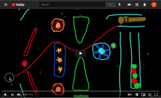

```{r setup, include=FALSE}
knitr::opts_chunk$set(echo = FALSE)
library(tidyverse)
library(psych)
library(effectsize)
statAB <- read.csv("statAB.csv")
BSEAP <- read.csv("BSnewEAP.csv")
```

# Physics Playground The Game

## Gameplay Sketching

[Sketching Levels](https://youtu.be/VGZ_QyDpXD8)



Players draw objects (ramps, pendulums, levers, springboards) to get ball to balloon.

## Gameplay Manipulation

[Manipulation Levels](https://youtu.be/TzDvJRFweKM)


Players manipulate physics parameters (gravity, ball mass, air resistance, bounciness) to get ball to balloon.

## Four Process Architecture

* **Presentation** (Game Engine) -- Presents game level captures _work product_ (collection of events).

* **Evidence Identification** (Server) -- Processes events for a game level to create observable evidence sets for the game levels.

* **Evidence Accumulation** (Server) -- Uses Bayesian networks to estimate physics proficiencies from game levels.

* **Activity Selection** (Game Engine) -- Picks next game level based on current ability estimates.

Note:  Events and evidence sets are stored in a database, so scoring can easily be rerun by marking evidence sets as "unprocessed" and reprocessing.


## Physics Playground Model


* 4 high-level proficiencies (salmon)
* 9 low-level proficiencies (orange).  

Each nodes has states `High`, `Medium`
and `Low`.  

## Physics Playground Q-Matrix

There is a collection of evidence models:  one for each game level.

These are represented through an augmented Q-matrix

[online sheet](https://docs.google.com/spreadsheets/d/16LcEuCspZjiBoZ3-Y1R3jxi1COXmh9vuTa9GwH1A_7Q/)

[Peanut package](https://pluto.coe.fsu.edu/RNetica/Peanut.html) has code for building Bayes nets from spreadsheet.

## Physics Playground Scores

* _Margin_ -- Probabilities for 
  `High`, `Medium` and `Low` (vector valued).  
  
* _Mode_ -- One of `High`, `Medium` or `Low` with highest probability.  
  
* _EAP (Expected A Posteriori)_ -- Assign the value +1 to `High`, 0 to   `Medium` and -1 to `Low` and then calculate the expected value.
  This can be also expressed as $\Pr(High) -\Pr(Low)$.  The score runs
  from +1 (high) to -1 (low).  (In the implementation, .97 and -.97
  was used, so the actual scores do not every quite reach +1 or -1).
  
[EABN Engine](https://pluto.coe.fsu.edu/Proc4) can spit out each of these score types for each node.

# Reliability

## Split Halfs

* "Items" are game levels:  need to leave game levels intact.

* Pair game levels on:

  - Primary and Secondary Skills
  - Difficulty
  - Other features
  
* Randomly assign one level of each pair to _Form A_ and _Form B_.

## Rescoring Logic

* Mark observable sets from _Form A_ levels as unscored.  Rescore to get _Form A_ scores.

* Mark observable sets from _Form B_ levels as unscored.  Rescore to get _Form B_ scores.

## Reliabilities:  EAP correlations

EAP scores are continuous, so can use ordinary correlations.

Optionally apply Spearman-Brown corrections

```{r Reliability, echo=FALSE}
corlist <- data.frame(
  Measure=c("Physics","Force and Motion","Linear Momentum",
            "Energy", "Torque"),
  Reliability=c(
    cor(statAB$Physics_EAPA,statAB$Physics_EAPB),
    cor(statAB$ForceAndMotion_EAPA,statAB$ForceAndMotion_EAPB),
    cor(statAB$LinearMomentum_EAPA,statAB$LinearMomentum_EAPB),
    cor(statAB$Energy_EAPA,statAB$Energy_EAPB),
    cor(statAB$Torque_EAPA,statAB$Torque_EAPB)))


knitr::kable(corlist,digits=3,caption="Correlations between Form A and B sub-forms.")

```


## Scatterplot (Higher Reliability)

```{r Energy, echo=FALSE, message=FALSE, fig.cap="Energy EAP score consistency"}
ggplot(statAB) + geom_point(aes(Energy_EAPA,Energy_EAPB)) + 
  geom_smooth(method="lm",aes(Energy_EAPA,Energy_EAPB)) + 
  labs(x="EAP(Energy) -- Form A",
       y="EAP(Energy) -- Form B")
```

## Scatterplot (Lower Reliability)

```{r Momentum, echo=FALSE, message=FALSE, fig.cap="Linear Momentum EAP score consistency"}
ggplot(statAB) + geom_point(aes(LinearMomentum_EAPA,LinearMomentum_EAPB)) + 
  geom_smooth(method="lm",aes(LinearMomentum_EAPA,LinearMomentum_EAPB)) + 
  labs(x="EAP(Momentum) -- Form A",
       y="EAP(Momentum) -- Form B")
```


## Reliabilities:  Modal Kappas

```{r ModalKappas, echo=TRUE}
modalTab <- table(statAB$Physics_ModeA,statAB$Physics_ModeB)
```
```{r KappaOutput,echo=FALSE}
knitr::kable(modalTab,caption="Agreement of Physics Modal Scores.")
cohen.kappa(modalTab)
```

The `cohen.kappa` function is from the `psych` package.


## Expected Kappas (1)

Get the "expected agreement" table by multiplying the margin scores together.
```{r Margins,echo=TRUE}
statAB[1,paste("Physics_Margin.",c("High","Medium","Low"),"A",sep="")]
statAB[1,paste("Physics_Margin.",c("High","Medium","Low"),"B",sep="")]
```
## Expected Kappas (2)
```{r ExpectedAggrement1,echo=TRUE}
outer(
  as.numeric(statAB[1,paste("Physics_Margin.",c("High","Medium","Low"),"A",sep="")]),
  as.numeric(statAB[1,paste("Physics_Margin.",c("High","Medium","Low"),"B",sep="")])
)
```
## Expected Kappas (3)

Now sum accros students:

```{r ExpectedAgreement,echo=TRUE}
states <- c("High","Medium","Low")
expTab <- outer(
  as.numeric(statAB[1,paste("Physics_Margin.",states,"A",sep="")]),
  as.numeric(statAB[1,paste("Physics_Margin.",states,"B",sep="")])
)
for (irow in 2:(nrow(statAB))) {
  itab <- outer(
  as.numeric(statAB[irow,paste("Physics_Margin.",states,"A",sep="")]),
  as.numeric(statAB[irow,paste("Physics_Margin.",states,"B",sep="")])
  )
  if (all(!is.na(itab))) 
    expTab <- expTab + itab
}
rownames(expTab) <- states
colnames(expTab) <- states
```

## Expected Kappas (4)

```{r EKappaOutput,echo=FALSE}
knitr::kable(expTab,digits=3,caption="Agreement of Physics Marginal Scores.")
cohen.kappa(expTab)
```


# Validity

## Correlations with external measures

The Fall 2019 Field trial included a pret-test and post-test.  

Items were coded to subscales matching the 4 high-level (salmon) nodes.

```{r Cormat, echo=FALSE}

knitr::kable(cor(select(BSEAP,c("preScore","postScore","Physics_EAP"))),
             digits=3,caption="Correlation of Physics EAP score with whole pretest and posttest.",booktabs=T)

```

## Subscales

As the subscale measures are short, sum the pre
-test and post-test scores

```{r Validity, echo=FALSE}
corlist$Validity <- c(
  cor(BSEAP$preScore+BSEAP$postScore,BSEAP$Physics_EAP),
  cor(BSEAP$ForceAndMotion_EAP,BSEAP$prepostNFM),
  cor(BSEAP$LinearMomentum_EAP,BSEAP$prepostMomentum),
  cor(BSEAP$Energy_EAP,BSEAP$prepostEnergy),
  cor(BSEAP$Torque_EAP,BSEAP$prepostTorque)
)
knitr::kable(corlist,digits=3,
             caption="Reliability (sub-form correlations) and Valitity (corrlation with pretest + posttest)",booktabs=T)

```

## Eta Statistic

Can use the $\eta$ or $\eta^2$ statistic to show how much of variability in score is explained by classification.

```{r EtaOverall, echo=TRUE}
## AOV expect factors.
BSEAP$Physics_Mode <- factor(BSEAP$Physics_Mode)
## Pretest
preaov <- aov(preScore ~ Physics_Mode,data=BSEAP)
cat("Pretest eta:", round(
  sqrt(eta_squared(preaov, partial=FALSE)$Eta_Sq),
 digits=2),"\n")
```


```{r EtaPost, echo=FALSE}
##Posttest
postaov <- aov(postScore ~ Physics_Mode,data=BSEAP)
cat("Posttest eta:", round(
  sqrt(eta_squared(postaov, partial=FALSE)$Eta_Sq),
 digits=2),"\n")
  
```

The `eta_squared` function is from the `effectsize` package.


## Discussion

These techniques work with any CDM which provides probability distributions over mastery states.

ECD models really help to produce matched forms for split-halfs.

These calculations can be used in formatory analysis.

Can do this with simulated data to examine form designs.

## Resources

* Physics Playground:  https://pluto.coe.fsu.edu/ppteam/

* RNetica and Peanut (Bayes net tools):  https://pluto.coe.fsu.edu/RNetica

* Four Process Scoring Tools:  https://pluto.coe.fsu.edu/Proc4

* Russell's Github page:  https://github.com/ralmond
