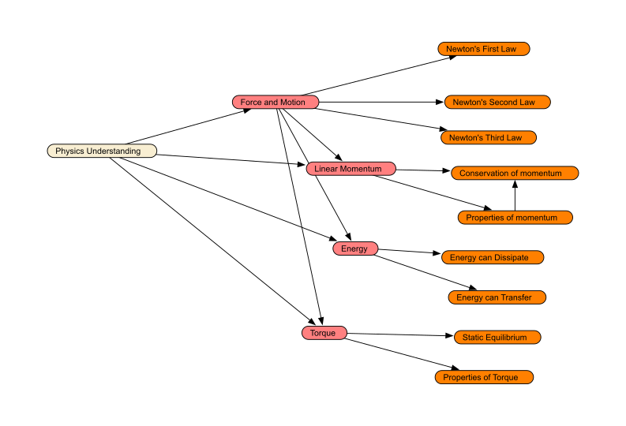

```{r setup, include=FALSE}
knitr::opts_chunk$set(echo = TRUE)
library(tidyverse)
library(psych)
statAB <- read.csv("statAB.csv")
BSEAP <- read.csv("BSnewEAP.csv")
```

# Calculating the Reliability and Validity of _Physics Playground_

This paper presents a case study in calculating reliability and
validity for a cognitively diagnostic assessment of Physics using the
game _Physics Playground_.  The game is part of a game-based learning
system, so that students received instruction and feedback related to
Physics as they played.  The game contained an internal measure of
Physics built with a Bayesian network.  In the Spring of 2019, a field
trial involving 199 students played the game for 5 class periods and
also took an external measure of Physics understanding.  This allows
for studying validity in the sense of correlation with the external
measure. 



The proficiency model for Physics used in _Physics Playground_
consists of for high-level proficiencies (colored salmon in the
figure) and nine low-level proficiencies.  Each of these nodes is
represented by an ordered variable with three states, `High`, `Medium`
and `Low`.  The Bayes net provides a probability distribution over
these possible states for each node.  There are thus three possible
statistics for each node that can be used as scores.

* _Margin_ -- This is a vector valued score with the probabilities for
  `High`, `Medium` and `Low`.  The values will always add to 1.  Note
  that any one of the three components can be used as a continuous score.
  
* _Mode_ -- This is `High`, `Medium` or `Low` depending on which one
  has the highest probability.  This is a categorical score.
  
* _EAP (Expected A Posteriori)_ -- Assign the value +1 to `High`, 0 to
  `Medium` and -1 to `Low` and then calculate the expected value.
  This can be also expressed as $\Pr(High) -\Pr(Low)$.  The score runs
  from +1 (high) to -1 (low).  (In the implementation, .97 and -.97
  was used, so the actual scores do not every quite reach +1 or -1).
  
The EAP score is the one we primarily use for reporting.  Its
reliability can be calculated using a split-half strategy and
correlation.  The categorical score is an alternative, however, the
same split-half strategy can be used but this time with Cohen's
kappa.  An improved categorical reliability can be calculated using the
marginal scores (Almond et al, 2015).  The paper illustrates all three
methods using the data from the Spring 2019 field trial.

## _Physics Playground_

_Physics Playground_ (Shute et al, 2019) is a 2d Physics game that
consists of a number of levels.  Each level is a puzzle in which the
player must use the principles of Newtonian Physics to move the ball
to the target balloon.  Players win a gold trophy for an efficient
solution and a silver trophy for any solution.  The game also records
how long the player took, how many objects were drawn and how many
manipulations were made.

Each game level has multiple observable outcome variables.  All levels
had variables related to the trophy one and the time spent on the
level.  Depending on the content of the level other variables were
also available, such as how many objects did the player create and how
many times did the player manipulate sliders which controlled gravity,
air resistance and other parameters. The complete Q-matrix for this project was kept in a [online sheet](https://docs.google.com/spreadsheets/d/16LcEuCspZjiBoZ3-Y1R3jxi1COXmh9vuTa9GwH1A_7Q/). One of the advantages of working
with Bayesian networks is that they can be readily extended to
multiple observations per task.

Each game level was coded with a primary and secondary physics
competency (one of the nine low-level nodes in Figure 1).  The levels
were also rated as to difficulty along two dimensions, _Physics
Understanding_ and _Game Mechanics_.  The former is related to the
difficulty of the items and the latter the discrimination.  These were
used to build extended $Q$-matrixes for _Physics Playground_.  These
are stored in an [online
spreadsheet](https://docs.google.com/spreadsheets/d/16LcEuCspZjiBoZ3-Y1R3jxi1COXmh9vuTa9GwH1A_7Q/).
This Bayesian networks used for scoring are built directly from this
spreadsheet using the [Peanut](https://github.com/ralmond/Peanut) and
the [EABN](https://github.com/ralmond/EABN)  packages (Almond, 2020a, b).  These packages allow the model parameters to be read from the spreadsheet.

<<Add more details here>>

In the Fall 2019 study, players were randomized into three different
conditions which determined the order of the game levels.  The players
in the `linear` condition saw the game levels in a fixed sequence,
players in the `adaptive` condition saw a sequence determined by the
scoring engine, and players in the `user control` condition could
choose which level they played next.  Due to some technical problems
(now resolved) the adaptive condition did not show much
player-to-player variability.   There were 75 game levels available to
the players, but most players completed substantially fewer.  As the
Bayesian network can produce a score after the completion of any
number of levels, levels that were not attempted were simply not
scored. 

## Split-Half Reliabilities for EAP Scores

The use of the $Q$-matrix and the difficulty indexes made it easy to
create matched half-tests.  The forms were balanced according to (a)
the primary and secondary skills tapped (i.e., the $Q$-matrixes has
approximately the same structure as each other and the full test) as
well as physics understanding and game mechanics difficulty metrics.
They were also balanced as to whether the levels appeared early or
late in the default sequence, so that the number of not-reached levels
should be approximately the same in both forms.  

It is a straightforward extension of the basic scoring algorithm for
the game to score the two half-forms.  Player observables were stored
in a database.  To score Form A, the observables from Form A levels
were marked as unprocessed and the assessment was rescored.  The same
trick was applied to Form B.  This produced a score on each of the 14
nodes of the proficiency model from both forms.  The correlation among
those forms in our measure of reliability.  

<<Add more detail>>


For the Fall 2019 data, we got the following reliability numbers for
the EAP scores of the high-level nodes:


```{r Reliability, echo=FALSE}
corlist <- data.frame(
  Measure=c("Physics","Force and Motion","Linear Momentum",
            "Energy", "Torque"),
  Reliability=c(
    cor(statAB$Physics_EAPA,statAB$Physics_EAPB),
    cor(statAB$ForceAndMotion_EAPA,statAB$ForceAndMotion_EAPB),
    cor(statAB$LinearMomentum_EAPA,statAB$LinearMomentum_EAPB),
    cor(statAB$Energy_EAPA,statAB$Energy_EAPB),
    cor(statAB$Torque_EAPA,statAB$Torque_EAPB)))


knitr::kable(corlist,digits=3,caption="Correlations between Form A and B sub-forms.")

```

These numbers are somewhat disappointing, however, they are also prior
to any refining or calibration of the network.  We did not use the Spearman-Brown formula, which would adjust for test length.  Figure 2 show the
correlation for the Energy node which had the best performance, while
Figure 3 shows the correlation for Linear Momentum, which had the
worst.  


```{r Energy, echo=FALSE, message=FALSE, fig.cap="Energy EAP score consistency"}
ggplot(statAB) + geom_point(aes(Energy_EAPA,Energy_EAPB)) + 
  geom_smooth(method="lm",aes(Energy_EAPA,Energy_EAPB)) + 
  labs(x="EAP(Energy) -- Form A",
       y="EAP(Energy) -- Form B")
```
```{r Momentum, echo=FALSE, message=FALSE, fig.cap="Linear Momentum EAP score consistency"}
ggplot(statAB) + geom_point(aes(LinearMomentum_EAPA,LinearMomentum_EAPB)) + 
  geom_smooth(method="lm",aes(LinearMomentum_EAPA,LinearMomentum_EAPB)) + 
  labs(x="EAP(Momentum) -- Form A",
       y="EAP(Momentum) -- Form B")
```

## Split-Half Consistency Scores

Turing to the modal scores, each student has a modal score from Form A
and Form B.  We can make this to use a simple cross-tabulation as in
Table 2.  Note that no student was classified as `High` in Physics
understanding.  This indicates that the model is likely not well
calibrated.  It also may be the case that the game is more difficult
than expected.  (Games typically tend to be more difficult that
conventional assessments as the challenge is part of the game-like
aspect.)

```{r Crosstab, echo=FALSE}
statAB %>% select(starts_with("Physics_Mode")) %>% table(dnn=c("A","B")) -> tabAB
#cohen.kappa(tabAB)
tab0 <- as.table(
  matrix(0,3,3,
  dimnames= list(A=c("H","M","L"),
                 B=c("H","M","L"))))
rtabAB <- tab0
rtabAB[c("M","L"),c("M","L")] <- tabAB[c("M","L"),c("M","L")]
knitr::kable(rtabAB,"latex",caption="Crosstabulation betwen Form A and Form B Modal scores.",booktabs=T)
```

Cohen's kappa for this table is 
`r round(cohen.kappa(rtabAB)$kappa,digits=2)`, which is disappointing.
There are a number of possible problems which could lead to such low
results. 

One known problem with the modal score is that it looses information.
In particular, a student who is on the borderline between `Medium` and
`Low` and a student who is on the borderline between `Medium` and
`High` can both be classified as `Medium`.  Looking using the marginal
scores instead of the modal scores gets around this problem.  Consider
a randomly chosen student.  That students marginal Physics scores on
Form A and Form B are:

```{r FormAB124, echo=FALSE}
stud <- 124
knitr::kable(statAB[stud,c("Physics_Margin.HighA","Physics_Margin.MediumA","Physics_Margin.LowA")],"latex",booktabs=T,digits=3,col.names=c("High","Med","Low"), row.names=FALSE,caption="Marginal Physics scores for Student 124, Form A")
knitr::kable(statAB[stud,c("Physics_Margin.HighB","Physics_Margin.MediumB","Physics_Margin.LowB")],"latex",booktabs=T,digits=3,col.names=c("High","Med","Low"), row.names=FALSE,caption="Marginal Physics scores for Student 124, Form B")
```


Taking the outer product of those two vectors, we get a
probabilistic confusion matrix:

```{r expAB124, echo=FALSE}
astats <- as.numeric(statAB[stud,c("Physics_Margin.HighA","Physics_Margin.MediumA","Physics_Margin.LowA")])
bstats <-   as.numeric(statAB[stud,c("Physics_Margin.HighB","Physics_Margin.MediumB","Physics_Margin.LowB")])
ptab124 <- astats %o% bstats
dimnames(ptab124) <- dimnames(tab0)
knitr::kable(ptab124,"latex",digits=3,caption="Expected crosstabulation for Student 124",booktabs=T)
```
Summing these across all 199 students yields a similar crosstab.

```{r ProbAB, echo=FALSE}
ptabAB <- matrix(0,3,3,dimnames=dimnames(tab0))
for (i in 1:nrow(statAB)) {
  astats <- as.numeric(statAB[i,c("Physics_Margin.HighA","Physics_Margin.MediumA","Physics_Margin.LowA")])
  bstats <-   as.numeric(statAB[i,c("Physics_Margin.HighB","Physics_Margin.MediumB","Physics_Margin.LowB")])
  if (!any(is.na(astats) && !any(is.na(bstats))))
    ptabAB <- ptabAB + astats %o% bstats 
}
knitr::kable(ptabAB,"latex",digits=2,caption="Expected crosstabulation, all 199 students.",booktabs=T)
```

Cohen's kappa remains unchanged at 
`r round(cohen.kappa(ptabAB)$kappa,digits=2)`.  This suggests that the
problem is with the assessment.  Candidate issues include the lack of
calibration of the evidence and proficiency models, a task mix that is
too difficult, or a much smaller effective test length and students
mostly did not complete the whole assessment.

## Correlations with Pretest and Posttest

As the Fall 2019 data collection involved a pretest and post-test, it is possible to look at the correlation between the subscores from the Bayesian network and the scores on the pretest and post-test items designed to measure the same aspects of proficiency.  In all cases, we averaged the pretest and post-test to get alonger effect test length for the criteriom measure, and did the correlation with the EAP scores from the full form.

```{r Cormat, echo=FALSE}

knitr::kable(cor(select(BSEAP,c("preScore","postScore","Physics_EAP"))),
             "latex",digits=3,caption="Correlation of Physics EAP score with whole pretest and posttest.",booktabs=T)

```

While the pre-test and post-test hang together fairly well, the correlation with the overall Physics score is disappointingly low.  A large part of the problem is likely the same issues causing low reliability.

Turning to the four high-level nodes, we can also look at the correlation with items on the pretest and post-test designed to tap those aspects of proficiency.  In this case, we add the pretest and post-test scores together to make a longer instrument.

```{r Validity, echo=FALSE}
corlist$Validity <- c(
  cor(BSEAP$preScore+BSEAP$postScore,BSEAP$Physics_EAP),
  cor(BSEAP$ForceAndMotion_EAP,BSEAP$prepostNFM),
  cor(BSEAP$LinearMomentum_EAP,BSEAP$prepostMomentum),
  cor(BSEAP$Energy_EAP,BSEAP$prepostEnergy),
  cor(BSEAP$Torque_EAP,BSEAP$prepostTorque)
)
knitr::kable(corlist,"latex",digits=3,
             caption="Reliability (sub-form correlations) and Valitity (corrlation with pretest + posttest)",booktabs=T)

```

Again, these results are somewhat disappointing.  However, the same steps necessary to increase the reliability should increase the validity as well.


## ECD and Validity

Correlations with an external post-test are just one part of a
complete validity argument (Kane, 2006).  Here, the evidence-centered
design methodology used in the game's construction (Shute et al,
2019) provides a more qualitative approach to validity.  In
particular, the work with experts in Physics pedagogy to validate the
$Q$-matrix is an important part of the validity argument.  In
particular, each game level represents valued work in the domain of
Physics.

That said, the reliabilities were disappointing, but looking at
reliabilities at the subscore rather than overall score level offers
insight into where and how the assessment can be improved.  One
obvious first step is to do a calibration and move from the expert
first guesses in discrimination and difficulty to something which
incorporates the observed data.  Another approach is to look closely
at both the game levels and the scoring models (particularly the
choice of observables) for the low information levels to see if
improvements can be made.  

Finally, the fact that different tasks are attempted by different
numbers of students adds a number of complications into the study of
reliability and validity.  It is quite possible that the different
reliability of different measures is related to how many tasks
students usually attempted in those areas.  In particular, a specific
reliability/validity study where the tasks are scheduled to provide a
more uniform exposure might improve the reliability measures.  In this
scheduling, the system would cycle through all of the sub-domains,
while the activity selection algorithms for _Physics Playground_ have
attempted to deliberately stay within a sub-domain for an extended
period to maximize learning.  This suggests that different data
collections may be needed for evaluating the effectiveness of _Physics
Playground_ as a learning environment and as a measurement tool.

## Acknowledgements

We would like to thank NSF for sponsoring the _Physics Playground_ project (NSF #1628937) and especially Val Shute, Principle Investigator.  Other member of the Physics Playground team (past and present) include:  Don Franceschetti, Renata Kamikabeya, Fengfeng Ke, Adam LaMee, Xi Lu, Mathew Martens, Ginny Smith and Weinan Zhao.

## References

Almond, R. G., Mislevy, R. J., Steinberg, L. S., Yan, D. and Willaimson, D. M. (2015).  _Bayesian Network in Educational Assessment_.  Springer.

Almond, R. G. (2020a) Peanut -- Software for Parameterized Bayesian Networks.  Computer software available from https://pluto.coe.fsu.edu/RNetica/Peanut.html or https://github.com/ralmond/Peanut/.

Almond (2020b) EABN -- Evidence Accumulation with Bayesian Networks.  Computer software available  from https://pluto.coe.fsu.edu/Proc4/ or https://github.com/ralmond/EABN/.

Kane, M. T. (2006).  Validation.  _Educational Measurement (4th Edition)._  American Council on Education/Praeger, 2006.

Shute, V. J., Ke, Fengfeng, Almond, Russell G., Rahimi, S., Smith, G. and Lu, X. (2019).  How to Increase Learning while not Decreasing the Fun in Educaitonal Games.  _Learning Science:  Theory, Research and Practice._ 327--357.
