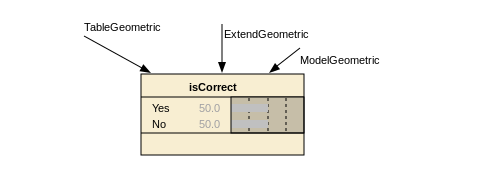

 __Bayesian Networks in__    __Educational Assessment__ 

 __Tutorial__ 

 __Session III:__    __ __    __Bayes Net with R__ 

Duanli Yan\, Diego Zapata\, ETS

Russell Almond\, FSU

2021 NCME Tutorial: Bayesian   Networks in Educational   Assessment

 _SESSION_    __	__    __	__    _TOPIC_    __	__    __	__    __	__    __	__    __	__    __	__    __	__    _PRESENTERS_ 

 __Session 1__   :   Evidence Centered Design   	  	  Diego Zapata                         	                 Bayesian Networks  	     	  	  	  	

 __Session 2__   :   Bayes Net Applications   	               	  Duanli Yan &                          	                 ACED: ECD in Action   	     	        Russell Almond  	             	           	  	

 __Session 3__   :   Bayes Nets with R   	  	  	  	  Russell Almond &   	  	     	  	  	  	  	  	  	  	  	  	  	  Duanli Yan         

 __Session 4__   :   Refining Bayes Nets with   	  	  Duanli Yan &   	             	     Data   	  	  	  	  	  	  	  	  Russell Almond 

# RNetica

# Quick Start Guide
Scoring A Student

RNetica Quick Start

# Downloading

*  _[http://pluto\.coe\.fsu\.edu/RNetica/](http://pluto.coe.fsu.edu/RNetica/)_ 
* Four Packages:
  * RNetica – R to Netica link
  * CPTtools – Design patterns for CPTs
  * Peanut/PNetica \-\- Object\-Oriented Parameterized Network
* Source & binary version \(Win 64\, Mac OS X\)
  * Binary versions include Netica\.dll/libNetica\.so
    * In RStudio select “Package Archive” rather than CRAN
  * Source version need to download from    _[http://www\.norsys\.com/](http://www.norsys.com/)_    first
    * See INSTALLATION

RNetica Quick Start

# License

* R – GPL\-3 \(Free and open source\)
* RNetica – Artistic \(Free and open source\)
* Netica\.dll/libNetica\.so – Commercial \(open API\, but not open source\)
  * Free Student/Demo version
    * Limited number of nodes
    * Limited usage \(education\, evaluation of Netica\)
  * Paid version \(see    _[http://www\.norsys\.com/](http://www.norsys.com/)_    for price information\)
    *    Need to purchase API not GUI version of Netica
    * May want both \(use GUI to visualize networks build in RNetica\)
* CPTtools – Artistic \(Free and open source\)\, does not depend on Netica

RNetica Quick Start

# Installing the License Key

When you purchase a license\, Norsys will send you a license key\.  Something that looks like:  “\+Course/FloridaSU/Ex15\-05\-30\,120\,310/XXXXX” \(Where I’ve obscured the last 5 security digits\)

To install the license key\, start R in your project directory and type:

> NeticaLicenseKey <\- “\+Course/FloridaSU/Ex15\-05\-30\,120\,310/XXXXX” 

> q\(“yes”\)

Restart R and type

> library\(RNetica\)

If license key is not installed\, then you will get the limited/student mode\.  Most of these examples will run

RNetica Quick Start

# The R heap and the Netica heap

R and Netica have two different workspaces \(memory heaps\)

R workspace is saved and restored automatically when you quick and restart R\.

Netica heap must be reconnected manually\.

RNetica Quick Start

# Active and Inactive pointers

When RNetica creates/finds a Netica object it creates a corresponding R object

If the R object is active then it points to the Netica object\, and the Netica object points back at it

If the pointer gets broken \(saving & restarting R\, deleting the network/node\) then the R object becomes inactive\.

The function is\.active\(nodeOrNet\) test to see if the node/net is active

RNetica Quick Start

# Mini-ACED Proficiency model

Subset of ACED network \(Shute\, Hansen & Almond \(2008\);    _[http://ecd\.ralmond\.net/ecdwiki/ACED](http://ecd.ralmond.net/ecdwiki/ACED)_    \)

Proficiency Model subset:

RNetica Quick Start

# Mini-ACED EM Fragments

All ACED tasks were scored correct/incorrect

Each evidence model is represented by a fragment consisting of observables with    _stub _   edges indicating where it should be    _adjoined_    with the network\.

Common Ratio Easy

Model Extend Table Hard

RNetica Quick Start

# Task to EM map

Need a table to tell us which EM to use with which task

| Task ID | EM Filename | X | Y |
| :-: | :-: | :-: | :-: |
| tCommonRatio1b | CommonRatioEasyEM | 108 | 414 |
| tCommonRatio2a | CommonRatioMedEM | 108 | 534 |
| tCommonRatio2b | CommonRatioMedEM | 108 | 654 |
| tCommonRatio3a | CommonRatioHardEM | 108 | 774 |
| tCommonRatio3b | CommonRatioHardEM | 108 | 894 |
| tExamplesGeometric1a | ExamplesEasyEM | 342 | 294 |
| tExamplesGeometric1b | ExamplesEasyEM | 342 | 414 |
|  |  |  |  |

RNetica Quick Start

# Scoring Script

Follow along using the script found in   ScoringScript\.R   in the miniACED folder\.

Don’t forget to   setwd\(\)   to the miniACED folder \(as it needs to find its networks\)\.

Don’t forget to set the license key before issuing   library\(RNetica\)   command\.

RNetica Quick Start

# Reloading Nets and Nodes

\#\# Scoring Script

\#\# Preliminaries

library\(RNetica\)

library\(CPTtools\)

\#\# Read in network – Do this every time R is restarted

profModel <\- ReadNetworks\("miniACEDPnet\.dne"\)

\#\# If profModels already exists could also use

\#\# Reconnect nodes – Do this every time R is restarted

allNodes <\- NetworkAllNodes\(profModel\)

sgp <\- allNodes$SolveGeometricProblems

profNodes <\- NetworkNodesInSet\(profModel\,"Proficiencies"\)

RNetica Quick Start

# Aside 1: Node Sets

* Netica defines a node set functionality which
  * Adds a collection of labels \(sets\) to each node
  * Defines a collection of nodes with that label
* Netica GUI really only offers the opportunity to color nodes by set
* RNetica can loop over node sets \(lists of nodes\)
* \#\# Node Sets
* NetworkNodeSets\(profModel\)
* NetworkNodesInSet\(profModel\,"pnodes"\)
* NodeSets\(sgp\)
* \#\# These are all settable
* NodeSets\(sgp\) <\- c\(NodeSets\(sgp\)\,"HighLevel"\)
* NodeSets\(sgp\)

RNetica Quick Start

# Aside 2:  RNetica Functions

\#\# Querying Nodes

NodeStates\(sgp\)     \#List states

NodeParents\(sgp\)    \#List parents

NodeLevels\(sgp\)     \#List numeric values associated with states

NodeProbs\(sgp\)   \# Conditional Probability Table \(as array\)

sgp\[\]   \# Conditional Probability Table \(as data frame\)

\#\# These are all settable \(can be used on RHS of <\-\) for 

\#\# model construction

\#\# Inference

CompileNetwork\(profModel\)   \#Lightning bolt on GUI   

\#\# Must do this before inference

\#\# Recompiling an already compiled network is harmless

RNetica Quick Start

# Aside 2: Inference

\#\# Enter Evidence by setting values for these functions

NodeValue\(sgp\)   \#View or set the value

NodeLikelihood\(sgp\)   \#Virtual evidence

\#\# Query beliefs

NodeBeliefs\(sgp\)   \#Current probability \(given entered evidence\)

NodeExpectedValue\(sgp\)   \#If node has values\, EAP

\#\# These aren't settable

\#\# Retract Evidence

RetractNodeFinding\(profNodes$ExamplesGeometric\)

RetractNetFindings\(profModel\)

RNetica Quick Start

# Aside 2: Example

\#\# Enter Evidence

NodeValue\(profNodes$CommonRatio\) <\- "Medium"

\#\# Enter Evidence "Not Low" \("High or Medium"\)

NodeLikelihood\(profNodes$ExamplesGeometric\) <\- c\(1\,1\,0\)

NodeBeliefs\(sgp\)   \#Current probability \(given entered evidence\)

NodeExpectedValue\(sgp\)   \#If node has values\, EAP

\#\# Retract Evidence

RetractNetFindings\(profModel\)

\#\# Many more examples

help\(RNetica\)

RNetica Quick Start

# Back to work

Load the evidence model table

Row names are task IDs

EM column contains evidence model name

EM filename has suffix   “\.dne”   attached\.

\#\# Read in task\->evidence model mapping

EMtable <\- read\.csv\("MiniACEDEMTable\.csv"\,row\.names=1\,

                      as\.is=2\)   \#Keep EM names as strings

head\(EMtable\) 

RNetica Quick Start

# A student walks into the test center …

* Student gives the name “Fred”
* Student is the right grade/age for ACED \(8  th   or 9  th   grader\, pre\-algebra\)
* Bayes net has three states
  * Fred logs into ACED
  * Fred attempts the task   tCommonRatio1a   and gets it right
  * Fred attempts the task   tCommonRatio2a   and gets it wrong

RNetica Quick Start

# Start a new student

\#\# Copy the master proficiency model

\#\# to make student model

Fred\.SM <\- CopyNetworks\(profModel\,"Fred"\)

Fred\.SMvars <\- NetworkAllNodes\(Fred\.SM\)

CompileNetwork\(Fred\.SM\)

\#\# Setup score history

prior <\- NodeBeliefs\(Fred\.SMvars$SolveGeometricProblems\)

Fred\.History <\- matrix\(prior\,1\,3\)

row\.names\(Fred\.History\) <\- "\*Baseline\*"

colnames\(Fred\.History\) <\- names\(prior\)

Fred\.History

RNetica Quick Start

# Score 1st Task

\#\#\# Fred does a task

t\.name <\- "tCommonRatio1a"

t\.isCorrect <\- "Yes"

\#\# Adjoin SM and EM

EMnet <\- ReadNetworks\(paste\(EMtable\[t\.name\,"EM"\]\,"dne"\,sep="\."\)\)

obs <\- AdjoinNetwork\(Fred\.SM\,EMnet\)

NetworkAllNodes\(Fred\.SM\) 

\#\# Fred\.SM is now the Motif for the current task\.

CompileNetwork\(Fred\.SM\)

\#\# Enter finding

NodeFinding\(obs$isCorrect\) <\- t\.isCorrect

RNetica Quick Start

# Stats and Cleanup for 1st task

\#\# Calculate statistics of interest

post <\- NodeBeliefs\(Fred\.SMvars$SolveGeometricProblems\)

Fred\.History <\- rbind\(Fred\.History\,new=post\)

rownames\(Fred\.History\)\[nrow\(Fred\.History\)\] <\- paste\(t\.name\,t\.isCorrect\,sep="="\)

Fred\.History

\#\# Cleanup and Observable no longer needed\, so absorb it:

DeleteNetwork\(EMnet\) \#\# Delete EM

\#\#  AbsorbNodes\(obs\)

\#\# Currently\, there is a Netica bug with Absorb Nodes\, we will leave

\#\# this node in place as that is mostly harmless\.

RNetica Quick Start

# 2nd Task

\#\#\# Fred does another task

t\.name <\- "tCommonRatio2a"

t\.isCorrect <\- "No"

EMnet <\- ReadNetworks\(paste\(EMtable\[t\.name\,"EM"\]\,"dne"\,sep="\."\)\)

obs <\- AdjoinNetwork\(Fred\.SM\,EMnet\)

NetworkAllNodes\(Fred\.SM\) 

\#\# Fred\.SM is now the Motif for the current task\.

CompileNetwork\(Fred\.SM\)

NodeFinding\(obs\[\[1\]\]\) <\- t\.isCorrect

post <\- NodeBeliefs\(Fred\.SMvars$SolveGeometricProblems\)

Fred\.History <\- rbind\(Fred\.History\,new=post\)

rownames\(Fred\.History\)\[nrow\(Fred\.History\)\] <\- 

        paste\(t\.name\,t\.isCorrect\,sep="="\)

Fred\.History

\#  \# Cleanup:  Delete EM and Absorb observables

DeleteNetwork\(EMnet\) \#\# Delete EM

\#\#   AbsorbNodes\(obs\)

RNetica Quick Start

# Save and Restore

\#\# Fred logs out

WriteNetworks\(Fred\.SM\,"FredSM\.dne"\)

DeleteNetwork\(Fred\.SM\)

is\.active\(Fred\.SM\)  

\#\# No longer active in Netica space

\#\# Fred logs back in

Fred\.SM <\- ReadNetworks\("FredSM\.dne"\)

is\.active\(Fred\.SM\)

RNetica Quick Start

# Getting Serious

* ACED field test has 230 students attempt all 63 tasks\.
* File miniACED\-Geometric contains 30 task subset
  * There may be data registration issues here\, don’t publish using these data before checking with me for an update
* Each row is one student Record
* Lets score the first student
  * And build a score history

RNetica Quick Start

# Setup for mini-ACED

miniACED\.data <\- read\.csv\("miniACED\-Geometric\.csv"\,row\.names=1\)

head\(miniACED\.data\)

names\(miniACED\.data\)

\#\# Mark columns of table corresponding to tasks

first\.task <\- 9

last\.task <\- ncol\(miniACED\.data\)

\#\# Code key for numeric values

t\.vals <\- c\("No"\,"Yes"\)

RNetica Quick Start

# Setup new Student

\#\# Pick a student\, we might normally iterate over this\.

Student\.row <\- 1

\#\# Setup for student in sample

\#\# Create Student Model from Proficiency Model

Student\.SM <\- CopyNetworks\(profModel\,"Student"\)

Student\.SMvars <\- NetworkAllNodes\(Student\.SM\)

CompileNetwork\(Student\.SM\)

\#\# Initialize history list

prior <\- NodeBeliefs\(Student\.SMvars$SolveGeometricProblems\)

Student\.History <\- matrix\(prior\,1\,3\)

row\.names\(Student\.History\) <\- "\*Baseline\*"

colnames\(Student\.History\) <\- names\(prior\)

RNetica Quick Start

# Loop Part 1:  Add Evidence

\#\# Now loop over tasks

for \(itask in first\.task:last\.task\) \{

      \#\# Look up the EM for the task\, and adjoin it\.

    tid <\- names\(miniACED\.data\)\[itask\]

    EMnet <\- ReadNetworks\(paste\(EMtable\[tid\,"EM"\]\,"dne"\,sep="\."\)\)

    obs <\- AdjoinNetwork\(Student\.SM\,EMnet\)

    CompileNetwork\(Student\.SM\)

    \#\# Add the evidence

    t\.val <\- t\.vals\[miniACED\.data\[Student\.row\,itask\]\]   \#Decode integer

    NodeFinding\(obs\[\[1\]\]\) <\- t\.val

RNetica Quick Start

# Loop Part 2: Capture Statistics

\#\# Update the history

    post <\- NodeBeliefs\(Student\.SMvars$SolveGeometricProblems\)

    Student\.History <\- rbind\(Student\.History\,new=post\)

    rownames\(Student\.History\)\[nrow\(Student\.History\)\] <\- paste\(tid\,t\.val\,sep="="\)

    \#\# Cleanup\, Delete EM and Absob Observables

    DeleteNetwork\(EMnet\)

    \#\# AbsorbNodes\(obs\) \# Still broken

\}

RNetica Quick Start

# Weight of Evidence

Good \(1985\)

 _H_    is binary hypothesis\, e\.g\.\,    _Proficiency_    >    _Medium_ 

 _E_    is evidence for hypothesis

Weight of Evidence \(WOE\) is

RNetica Quick Start

# Conditional Weight of Evidence

Can define Conditional Weight of Evidence

Nice Additive properties

Order sensitive

WOE Balance Sheet \(Madigan\, Mosurski & Almond\, 1997\)

RNetica Quick Start

# Weight of Evidence Balance Sheet

\#\# Now examine scoring history

head\(Student\.History\)

woeBal\(Student\.History\,c\("High"\,"Medium"\)\,"Low"\,

         title=paste\("Evidence Balance Sheet for "\,                      

         rownames\(miniACED\.data\)\[Student\.row\]\)\)

\#\# More ways to display scores

help\(CPTtools\)

RNetica Quick Start

