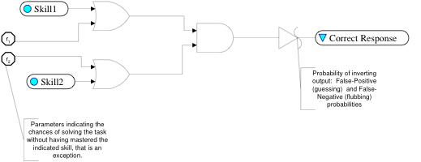
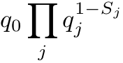
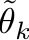
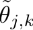
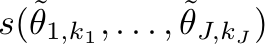
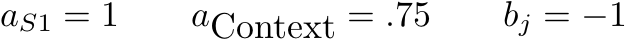
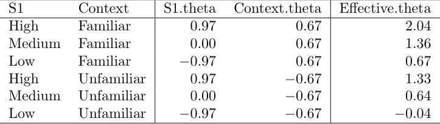
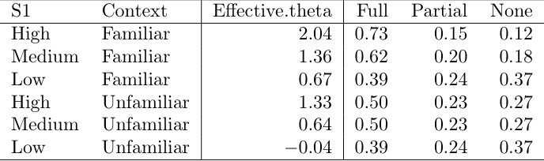

 __Bayesian Networks in__    __Educational Assessment__ 

 __Tutorial__ 

 __Session III: __    __Bayes Net with R__ 

Duanli Yan\, Diego Zapata\, ETS

Russell Almond\, FSU

2021 NCME Tutorial: Bayesian Networks in Educational Assessment

 _SESSION_    __	__    __	__    _TOPIC_    __	__    __	__    __	__    __	__    __	__    __	__    __	__    _PRESENTERS_ 

 __Session 1__   :   Evidence Centered Design   	  	  Diego Zapata                         	                 Bayesian Networks  	     	  	  	  	

 __Session 2__   :   Bayes Net Applications   	               	  Duanli Yan &                          	                 ACED: ECD in Action   	     	        Russell Almond  	             	           	  	

 __Session 3__   :   Bayes Nets with R   	  	  	  	  Russell Almond &   	  	     	  	  	  	  	  	  	  	  	  	  	  Duanli Yan         

 __Session 4__   :   Refining Bayes Nets with   	  	  Duanli Yan &   	             	     Data   	  	  	  	  	  	  	  	  Russell Almond 

# Discrete Partial Credit Model:  A generic framework for building CPTs

# Russell Almond

# Conditional Probability Tables

* Focus on a child variable
* Child has zero or more parent variables in graph
* For each configuration of parent variables\, need conditional probability of each child variable\.  
  * Unconditional probability in the case of no parents
* If there are    _N_    parents\, each with    _M_    states and the child variable has    _K_    states\, then the number of unconstrained entries in the table is
*  _M_    _N_    _\(K\-1\)_ 

# Problems

Too many parameters to comfortably elicit

Certain cases might be rare in population \(  Very High   on    _Skill 1_    and   Very Low   on    _Skill 2_   \)

Want to capture intuition of experts on how skills interact to generate performace\.

# Reduced Parameter Models

* Noisy\-and and Noisy\-Or models 
  * NIDA\, DINA and Fusion model \(Junker & Sijtsma\)
  * Assume binary responses
* Discrete IRT models
* DiBello—Samejima models
  * Based on “effective theta” and graded response model
  * Compensatory\, Conjunctive\, Disjunctive and Inhibitor relationships
* CPTtools framework
  * Effective theta mapping
  * Selectable combination rule
  * Selectable link function \(graded response\, normal\, generalized partial credit\)
* For all of these model types\, number of parameters grows linearly with number of parents

# Noisy-And (Or)

All input skills needed to solve problem

Bypass parameter for Skill    _j_   \,    _q_    _j_ 

Slip probability \(overall\)\,    _q_    _0_ 

Probability of correct outcome

NIDA/DINA

# Noisy Min (Max)

* If skills have more than two levels
  * Use a cut point to make skill binary \(e\.g\.\, reading skill must be greater than X\)
  * Use a Noisy\-min model
    * Probability of success is determined by the weakest skill
* Noisy\-And/Min common in ed\. measurement\, Noisy\-Or/Max common in diagnosis
* Number of parameters is linear in number of parents/states
* Variants of propagation algorithm take advantage of extra Noisy\-Or/And independence conditions

# Discrete IRT (2PL) model

* Imagine a case with a single parent and a binary \(correct/incorrect\) child\.
* Map states of parent variable onto a continuous scale:     _effective theta\, _ 
* Plug into IRT equation to get conditional probability of “correct”
  *  _a_    _j_    _ – _   discrimination parameter
  *  _b_    _j_    _ – _   difficulty parameter
  *  _1\.7 – _   Scaling constant \(makes logistic curve look like normal ogive\)

# DiBello--Samejima Models

Single parent version

Map each level of parent state to “effective theta” on IRT \(N\(0\,1\)\) scale\,

Now plug into Samejima graded response model to get probability of outcome

Uses standard IRT parameters\, “difficulty” and “discrimination” 

DiBello\-\-Normal model uses regression model rather than graded response

# Various Combination Rules

* For Multiple Parents\, assign each parent    _j _   an effective theta at each level    _k_   \,         \.
* Combine Using a Combination Rule \(Structure Function\)
* Possible Structure Functions:
  * Compensatory = average
  * Conjunctive = min
  * Disjunctive = max
  * Inhibitor; e\.g\. level    _k_   \* on      :
* where       is some low value\.

# Effective Thetas for Compensatory Relationship

equally spaced normal quantiles

# Effective Theta to CPT

Introduce new parameter    _d_    _inc_    _ _   as spread between difficulties in Samejima model

 _b_    _i\,Full_    _ = b_    _j_    _ \+ d_    _inc_    _/2                 b_    _j\,Partial_    _ = b_    _j_    _ \- d_    _inc_    _/2_    

Conditional probability table for   _ d_    _inc_    _ _   = 1 is then…

# CPTtools framework

* Building a CPT requires three steps:
* Map each parent state into a    _effective theta_    for that parent
* Combine the parent effective thetas to an effective theta for each row of the CPT using one \(or more\)    _combination rules_ 
  * Combination rules generally take one or more \(often one for each parent variable\)    _discrimination parameters_    which weight the parent variable contributions \(log alphas\)
  * Combination rules generally take one or more    _difficulty parameters_    \(often one for each state of the child variable\) which shift the average probability of a correct response \(betas\)
* Map the effect theta for each row into a conditional probability of seeing each state using a    _link function_ 
  * Link functions can take a scaling parameter\. \(link scale\)

# Parent level effective thetas

Effective theta scale is a logit scale corresponds to mean 0 SD 1 in a “standard” population\.

Want the effective theta values to be equally spaced on this scale

Want the marginal distribution implied by the effective thetas to be uniform \(unit of the combination operator\)

What the effective theta transformation to be effectively invertible \(this is reason to add the 1\.7 to the IRT equation\)\.

# Equally spaced quantiles of the normal distribution

Suppose variable has    _M_    states:     _0\,…\,M\-1_ 

Want the midpoint of the interval going from probability    _m/M _   to    _\(m\+1\)/M_   \.

Solution is to map state    _m_    onto 

R code:    qnorm\(\(1:M\)\-\.5\)/M\)

