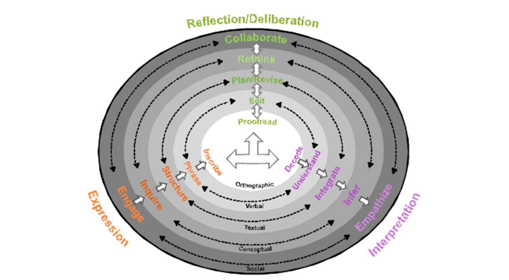

```{r setup, include=FALSE}
knitr::opts_chunk$set(echo = FALSE)
```

# ECD Reconceived

## Tasks and Task Features

* Presentation/Stimulus Material
  - Background Information
  - Prompt
  - Tools
  - Student-facing Rubric
* Work Product and Process
  - Final artifact
  - Event Log
* Features
  - Variables relating to the collection of evidence.  
  - Evidence (work products and processes) are collected in a _context_
     + _key1_: _val1_
     + _key2_: _val2_
     
## Classes of Feature Variables

* Topic

* Setting:  Time & Place

* Available Tools

* Activity Inputs

* Activity Outputs -- Work Product and Process
  + Observation Checklists

* Instructions & Scaffolding/Learning Supports -- Condition/Trigger 

* Group Composition

* **Learner/Feature Interactions**


## Evidence Rule Books

* Identification Rules

  - Determine _observable indicators_
 
  - Determine _feedback parameters_
 
  - Determine _research data_
 
  - Determine _intermediate observables_
  
  - Determine _context changes_
 
* Accumulation Rules (Statistical part)
 
  - Evidential Focus (which skills)
  
  - Skill demand (difficulty)
  
  - Evidential Strength (Discrimination)
  
  - Skill Breadth (which aspect of the skill)
  
An _Evidence Rule Book_ is a set of evidence rules which is appropriate in a particular _Scoring Context_

## Scoring Contexts

Certain evidence rules are only appropriate in certain contexts:

* Checking for correctly spelled words requires free text input.

* Mispelled words have different evidential strength if the writer had a dictionary, spell checker.

Could vary across persons:

* Prompt "Analyze a  Sonnet"
  - Has the writer read the sonnet before
  

## Dynamic Tasks

An activity for which some of the scoring features change during the student interacting with the task is a _dynamic task_.

* Multipart Task 
  - Read Stimulus Material
  - Answer Questions about Stimulus
  - Write Essay
  
* Games and Simulations
  - As simulation evironment changes, the scoring context might change.
  - Flight simulator:  Pre-flight check, take-off, cruising, storm, more cruising, approach, landing
  
* Complex Production Process
  - Writing
  - Student goals and subgoals affect scoring context
  - A pause means something different depending on when it occurs

## Writing Process State as Context Feature



Deane (2009) Model of Writing

## Hayes Core Cognitive Process Model


## HMM Model

{#id .class width=75% height=75%}


* Latent state is the process stage

* Observables are events in the keystroke log

* Evidentiary value of observables depends on latent state

* Latent state must be inferred from keystroke log

# The Papers

## Overview of the 12-Trait Model (Deane & Yan)

* 12-Traits are more like 12 Indicators/Observables/Features
  - Product Indicators

* Add about 7 Process Inidcators

* Spandel & Stiggens 6-trait model was aligned with instruction.

* [Inverse] Correlations among the 12 indicators provide structural information about how the features cluster

* Would cutting breaking the process features up in time reveal interesting patterns?
  - Early (1st quarter)
  - Middle (2nd & 3rd quarters)
  - Late (4th quarter)

## Profiling ... Before and After Instruction (Deane)

* Showing before/after difference is good.  Might be even able to do this at the student level.

* Are there pre-requisite effects? (e.g., mechanics before organization)

* Are there restriction of range effects?


## Leveraging Keystrokes to Identify Strategies (Kanopka)

* Moving from microfeatures to features (indicators)

* To what extent can indicator factors map to instructruction

* The logistic models are hard to translate.  
  - Begs question of normalization of features
  - Weight of Evidence?
  - Cross-validated accuracy
  - Regression model looks somewhat better
  
* Begs question to what extend typing speed limits performance

  
## Linking Traits to Writing Profiles (Zhang)

* Profiles are interestings, working towards what a teacher might want

* High correlations with productivity and many of the 12-product indicators

* Paragraphing and Organization also high correlation
  - Middle School?

## Linking Plan Quality to Essay Performance (Song)

* Adding another work product (plan) is an interesting way to capture data

* How much training do the students need on this planning technique?

* How do the process indicators fit with the plan features?