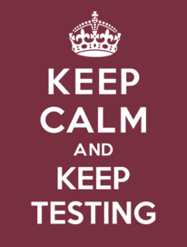

```{r setup, include=FALSE}
knitr::opts_chunk$set(echo = FALSE)
```

# Some Framing

## IRT and Invariance

IRT is said to be "invariant" to the test form and sample 
**under two assumptions**:

1. People are an random (unbiased) sample of the target population.

2. Items are a random (unbiased) sample of the universe of items.

## Difficulty and Demand

_Demand_ is how much of a skill is required to answer an item.

_Difficulty_ is related to the inverse probability of getting an item right.

    * Difficulty can be both content-relevant (demand) and content-irrelevant (e.g., form effects, DIF)
    
    * Difficulty is difficult to measure unless the average ability of the population is known (or assumed 0).

## Pandemic and Lockdown I:  Population Changes

1. People differ in their risk and risk tolerance in traveling away from home.

2. Changes in volumes/hours/locations for testing centers.  

3. Changes in cost.

4. Changes to instruction -- remote versus F2F

5. Non-uniform distribution of virus

  - Geographic
  
  - Racial/Ethnic

## Pandemic and Lockdown II:  Test Item Changes

1. Background cognitive load

2. Security Concerns:

   - Unsecure locations (home, coffee shop, &c)
   
   - Different test administrators
   
3. Scoring Differences
   
## Should Cut Scores change?

1. To what affect to changes in items/population affect score meaning?

2. Is state getting enough qualified candidates to meet needs?

3. Do qualified candidates meet diversity needs?

  - BIPOC

  - Gender

  - Geographic

# The Talks

## Olgar:  Free Testing Impacts on Psychometrics

* Increase in examinees from Out of Field

  - Teachers adding a second field
  
  - Non-teachers adding teaching

* Should not affect the _difficulty_ (demand)

  - but might influence _relative difficulty_

  - P-value is measuring _relative difficuty_
  
* With free testing, looks like adding more candidates at low end

* Without free testing, looks like discouraging candidates at low end


## Underwood:  Scoring from Home

* ETS Online Scoring Network

* Security comes down to can you trust your people

* Slipping reference essays into work flow

## White:  Free Testing and Field Testing

* When Equating with two different populations, which is the reference and which is the new

* When adjustment is pretty small, best adjustment might be none.

* Is five decimal places really reasonable?

## Kaira:  Free Testing Impacts on Performance

* Evidence that people are using the fee waiver test as a practice test

* Strong seasonal effect (beginning and end of waiver period)

* Possible to create released item practice test form?


## Arce:  Population Change and Pre and Post Equating

* Is the fee waiver impacting ability of non-White applicants to take the exam?

* Tree model -- I don't get an impression of the size of the difference between nodes
  
  - Expected score of person @ ability=0

* Is there evidence that the is a race affect (dare I apply _critical race theory_)

* Counting flags is probably noisier than averaging effects


# Further Discussion

## Remaining Questions

* Is there a geographic impact?
  
  - South/Central/Panhandle
  
  - Urban/Rural
  
* How have our needs changed because of the Pandemic

* Should we adjust the cut scores?

## Keep Calm and Keep Testing, but also Keep an Eye Out



But monitor the results in case something looks really different.
